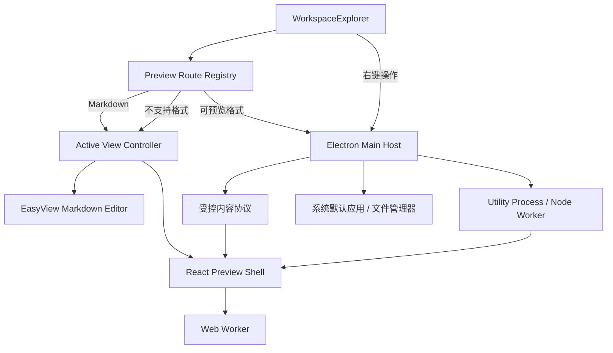

# EasyView Desktop 多格式文件预览实施方案

> 文档日期：2026-09-16
> 适用范围：`apps/desktop`
> 目标形态：在 EasyView Desktop 工作区中提供安全、稳定、可扩展的只读文件预览能力，Markdown 继续使用现有 EasyView 编辑器。

## 1. 建设目标

EasyView Desktop 在现有 Markdown 编辑能力之外，增加常见办公文档、文本、图片、设计文件、电子书和压缩包的应用内只读预览能力。

核心目标：

1. 工作区文件左键打开时，根据文件类型进入 Markdown 编辑器、应用内预览或不支持提示。
2. Markdown 始终复用现有 `@easyview/editor-core`，不迁移到 React，不改变现有保存、导出、历史记录和大纲能力。
3. 非 Markdown 文件在中间工作区以只读方式预览，不承诺完整编辑和原格式写回。
4. 任意普通文件均可通过右键菜单使用系统默认应用打开或在系统文件管理器中显示。
5. 文件读取、协议访问、压缩包处理、HTTP 请求和 Java 反编译均通过受控宿主能力完成，Renderer 不直接获得任意本地文件访问权限。
6. 各格式 Viewer 独立加载、独立失败、独立释放资源，避免单一格式影响整个应用。

## 2. 建设边界

### 2.1 本期建设内容

- Desktop 工作区文件打开分流。
- 编辑器视图与预览视图切换。
- 系统默认应用打开、文件管理器定位。
- 常见办公文档、文本、图片、设计文件、电子书和压缩包只读预览。
- Word 97–2003 `.doc` 和 PowerPoint 97–2003 `.ppt` 旧版二进制文件只读预览。
- 预览资源按需加载和解析任务隔离。
- 打包后静态资源、Worker、WASM 和可选 Java Decompiler 运行验证。

### 2.2 不在本期范围

- 不修改 VS Code 扩展侧文件打开行为。
- 不捆绑 LibreOffice。
- 不实现 DOCX、PPTX、XLSX、ODS、PSD、XMind 等格式的完整编辑和原格式写回。
- 不执行 Office 宏、嵌入脚本或外部可执行内容。
- HTTP Client 和 Java Class Decompiler 作为独立工具能力分阶段交付，不作为基础预览首期的阻塞项。
- 不直接复制或整仓引入 vscode-office 源码，仅参考其格式路由和开源库选型。

## 3. 当前实现基础

EasyView Desktop 当前具备以下基础：

- Renderer 使用 `@easyview/editor-core` 创建 Markdown 编辑器。
- BrowserWindow 已启用 `contextIsolation`、`sandbox`、`webSecurity`，并关闭 `nodeIntegration`。
- 工作区服务已具备根目录约束、目录读取和符号链接隔离。
- 工作区文件统一通过标签路由：Markdown 进入单实例编辑器，可预览文件进入中央 PreviewShell，不支持格式显示明确提示。
- 主进程按 Markdown 标签维护独立文档会话；关闭标签、切换工作区和退出应用时执行保存、放弃或取消确认。

Desktop 已改为多标签工作区模型：Markdown 与可预览文件均作为独立标签，同一路径只保留一个标签；Renderer 使用 ESM 拆包。中央内容区在任一时刻只显示选中标签对应的 Markdown 编辑器或文件预览。

## 4. 总体架构



### 4.1 分层职责

| 层级                            | 职责                              |
| ----------------------------- | ------------------------------- |
| WorkspaceExplorer             | 展示目录树、触发打开、发起右键操作，不负责格式解析       |
| Preview Route Registry        | 单一文件格式事实来源，负责后缀识别、路由、能力和限制定义    |
| Active View Controller        | 统一管理编辑器、预览和空状态，处理切换、菜单和标题状态     |
| React Preview Shell           | 只负责预览 UI、加载状态、错误状态和 Viewer 生命周期 |
| Electron Main Host            | 路径校验、预览会话、系统能力、受控协议和宿主任务调度      |
| Web Worker                    | PDF、Office、图片和设计格式的浏览器侧重型解析     |
| Utility Process / Node Worker | 压缩包、Java 反编译等可能阻塞主进程的任务         |

## 5. Desktop 多标签工作区模型

Desktop 使用标签集合表达已打开文件，不再以单一 `activeDocumentPath` 或单一 `ActiveWorkspaceView` 表达整个工作区。

```ts
type DesktopTab =
  | { id: string; kind: 'editor'; filePath: string; fileName: string; dirty: boolean }
  | { id: string; kind: 'preview'; relativePath: string; fileName: string; route: PreviewRoute };

interface DesktopTabSnapshot {
  tabs: DesktopTab[];
  activeTabId: string | null;
}
```

主进程是标签集合、Markdown 文档会话和活动标签的唯一事实来源。Renderer 的 `TabController` 只负责标签栏交互，`ActiveViewController` 只负责在中央内容区互斥显示单实例 Markdown 编辑器或 React 预览岛。

### 5.1 标签打开与切换规则

1. Markdown 和可预览文件均创建标签并立即选中；同一路径重复打开时激活已有标签。
2. Markdown 编辑器在窗口生命周期内保持单实例；切换 Markdown 标签时向同一实例发送目标文档 `init`，各标签的内容、脏状态、mtime 和外部冲突由主进程独立保存。
3. 打开或切换其他标签不触发脏文档确认。脏 Markdown 仅在关闭标签、切换工作区或退出应用时确认。
4. 激活预览标签时创建 PreviewSession；离开标签时关闭 Session 并释放 Worker、Canvas、Object URL 和 Viewer，重新激活时重新创建。
5. 单标签关闭使用“保存 / 不保存 / 取消”；多个脏标签退出时使用“全部保存 / 全部不保存 / 取消”。
6. 工作区持久化文件标签和选中标签，不持久化临时 PreviewSession、解析结果或未保存内容。
7. AI 对话面板作为 Desktop 全局最右侧面板，可在 Markdown、预览和空状态下打开并跨标签保持；Agent 文档修改能力仅在 Markdown 标签启用。大纲、重命名、历史和导出等文档能力仍根据选中标签类型启用。

### 5.2 中央显示结构

```text
Desktop Workbench
├── WorkspaceExplorer
└── CenterPane
    ├── TabBar
    └── ActiveContent
        ├── EasyView Markdown Editor
        └── React Preview Shell
```

`ActiveContent` 内的编辑器和预览容器互斥显示，预览不得作为 Markdown 编辑器右侧的并排区域。AI 对话面板位于工作区最右侧：Markdown 模式下排在文档目录右侧，预览模式下排在预览内容右侧。标签栏支持横向滚动，不提供重复标签、拖拽排序、固定标签、分栏或分屏。

## 6. 文件路由设计

### 6.1 单一路由注册表

在 `apps/desktop/src/contracts/preview.ts` 中建立声明式路由表，主进程和 Renderer 共用类型定义，避免主进程、ActiveViewController 和 React Viewer 分别维护后缀列表。React 预览目录内不得再建立独立 PreviewRegistry。

```ts
interface PreviewRouteDefinition {
  route: PreviewRoute;
  suffixes: readonly string[];
  delivery: 'content-url' | 'text' | 'utility-process';
  maxSourceBytes: number;
  capability: 'base' | 'office' | 'design' | 'archive' | 'tool';
}
```

路由规则：

- 后缀统一转为小写。
- 采用最长后缀优先，确保 `.tar.gz` 在 `.gz` 之前匹配。
- Markdown 后缀不进入 PreviewShell。
- 不支持的格式不自动执行系统打开，先显示不支持提示，由用户主动选择系统打开。
- 文件实际类型与后缀明显不符时终止解析并显示错误。

### 6.2 支持格式矩阵

| 类别         | 扩展名                                             | Viewer / 解析路线                                                                    | 阶段   |
| ---------- | ----------------------------------------------- | -------------------------------------------------------------------------------- | ---- |
| Markdown   | `.md` `.markdown` `.mdx`                        | 现有 EasyView 编辑器                                                                  | 现有能力 |
| 文本         | `.txt` `.log` `.json` `.yaml` `.yml`            | 文本 Viewer、JSON/YAML 格式化、搜索                                                       | 阶段一  |
| 表格文本       | `.csv` `.tsv`                                   | 流式文本解析、只读虚拟表格                                                                    | 阶段一  |
| 普通图片       | `.png` `.jpg` `.jpeg` `.gif` `.webp` `.bmp` `.ico` | 浏览器原生图片解码                                                                        | 阶段一  |
| SVG        | `.svg`                                          | 源码查看 + 隔离预览，不执行脚本                                                                | 阶段一  |
| PDF        | `.pdf`                                          | `pdfjs-dist` + 独立 Worker                                                         | 阶段一  |
| Excel      | `.xls` `.xlsx` `.xlsm` `.ods`                   | `xlsx` 解析 + 只读虚拟表格；不执行宏                                                          | 阶段二  |
| Word       | `.doc` `.docx` `.dotx`                          | `.doc`：`@file-viewer/doc` 解析 OLE/CFBF 并输出净化 HTML；`.docx/.dotx`：`docx-preview` 只读渲染 | 阶段二  |
| PowerPoint | `.ppt` `.pptx` `.pptm`                          | `.ppt`：按公共水印许可分发的 `@file-viewer/ppt` WASM/Canvas Viewer；`.pptx/.pptm`：`pptxviewjs` 只读渲染；不执行宏 | 阶段二  |
| 电子书        | `.epub`                                         | `epubjs`                                                                         | 阶段二  |
| 特殊图片       | `.heic` `.heif` `.tiff` `.tif`                  | `heic2any`、`utif`                                                                | 阶段三  |
| 设计文件       | `.psd` `.xmind` `.icns`                         | `ag-psd`、`mind-elixir`、ICNS Parser                                               | 阶段三  |
| 字体         | `.ttf` `.otf` `.woff` `.woff2`                  | `opentype.js` 字形和示例文本预览                                                          | 阶段三  |
| HTML       | `.html` `.htm`                                  | 源码查看 + sandbox iframe，默认禁止脚本                                                     | 阶段三  |
| 压缩包        | `.zip` `.jar` `.vsix` `.apk` `.tar` `.tar.gz` `.tgz` `.rar` `.7z` | 独立进程列举目录、按需读取条目                                                                  | 阶段三  |
| HTTP       | `.http` `.rest`                                 | CodeMirror + 显式请求执行                                                              | 阶段四  |
| Java Class | `.class`                                        | 可选 Java Decompiler                                                               | 阶段四  |

所有第三方库在正式接入前必须完成许可证、维护状态、安装包体积和 Electron 兼容性核查。当前 `@file-viewer/ppt` 使用 Flyfish Public Watermarked Runtime License v2：保留完整可见水印、LICENSE、NOTICE 和未修改运行时即可随集成产品分发；只有移除、遮挡或修改水印时才需要另行取得书面商业授权。构建检查必须验证许可证文件、NOTICE、WASM、Worker 和字体资产完整性。实际预览效果以项目样例集为准，不承诺与 Microsoft Office、Adobe 或 XMind 原生应用完全一致。

## 7. 内容交付与 IPC

### 7.1 预览会话

Renderer 不直接传递绝对路径，也不通过 IPC 获取通用的大型 `number[]`。

```ts
interface PreviewDescriptor {
  previewId: string;
  route: PreviewRoute;
  fileName: string;
  suffix: string;
  size: number;
  mtimeMs: number;
  contentUrl?: string;
}
```

主进程维护：

```ts
interface PreviewSession {
  id: string;
  rootPath: string;
  filePath: string;
  route: PreviewRoute;
  size: number;
  mtimeMs: number;
  createdAt: number;
}
```

### 7.2 受控内容协议

注册 `easyview-preview://` 只读协议，用于 PDF、Office、图片、字体等文件内容读取。

要求：

- URL 仅包含随机 `previewId`，不暴露绝对路径。
- 每次请求重新验证会话、文件元数据和工作区边界。
- 不允许目录遍历、任意查询路径或跨工作区访问。
- 会话关闭、视图切换和窗口关闭后立即失效。
- 支持 Range 请求的 Viewer 应保留 Range 语义，避免整文件重复加载。
- 协议只返回文件内容，不提供写入能力。

### 7.3 Preload API

```ts
interface PreviewApi {
  open(relativePath: string): Promise<OperationResult<PreviewDescriptor>>;
  close(previewId: string): Promise<OperationResult<boolean>>;
  readText(previewId: string): Promise<OperationResult<string>>;
}

interface SystemFileApi {
  openWithDefaultApp(relativePath: string): Promise<OperationResult<boolean>>;
  revealInFolder(relativePath: string): Promise<OperationResult<boolean>>;
}

interface ArchiveApi {
  list(previewId: string, password?: string): Promise<OperationResult<ArchiveEntry[]>>;
  readEntry(previewId: string, entryId: string, password?: string): Promise<OperationResult<ArchiveEntryContent>>;
  exportEntry(previewId: string, entryId: string): Promise<OperationResult<boolean>>;
}
```

所有 IPC Handler 必须：

- 验证消息来自当前受信 Renderer。
- 验证参数类型和长度。
- 使用 WorkspaceService 解析并约束路径。
- 拒绝符号链接和工作区外路径。
- 返回统一 `OperationResult`，不向 Renderer 暴露异常栈和宿主内部路径。

## 8. Renderer 与构建方案

### 8.1 React 作为独立预览岛

React 仅作为 Desktop 产品层的预览渲染容器，负责 PreviewShell、各格式 Viewer 的界面、局部交互和组件生命周期；不迁移现有标题栏、目录树和 Markdown 编辑器。

React 不负责以下能力：

- 不管理工作区活动视图状态。
- 不创建、销毁或持有 Markdown 编辑器实例。
- 不维护文件后缀和 PreviewRoute 的独立路由表。
- 不直接解析工作区路径或接触绝对路径。
- 不直接调用 `window.easyViewDesktop` 和 Electron IPC。
- 不控制应用菜单、标题栏、大纲或脏文档确认。

框架无关的 `ActiveViewController` 是编辑器、预览和空状态的唯一状态所有者；`PreviewController` 负责把 PreviewShell 的操作转换为受控 preload API 调用。React Viewer 只接收已经验证的 `PreviewDescriptor` 和显式操作回调。

```ts
interface PreviewShellProps {
  descriptor: PreviewDescriptor;
  onCancel(): void;
  onClose(): void;
  onOpenWithDefaultApp(): void;
}
```

推荐目录结构：

```text
apps/desktop/src/contracts/
└── preview.ts                  # PreviewRoute、Descriptor、路由定义和共享契约

apps/desktop/src/renderer/
├── renderer.ts                 # Desktop 组合入口
├── ActiveViewController.ts     # 活动视图唯一状态所有者
├── workspace/
│   └── WorkspaceExplorer.ts
└── preview/
    ├── bootstrap.tsx           # React Root 创建、更新和销毁
    ├── PreviewController.ts    # preload API 适配和 Viewer 生命周期
    ├── PreviewShell.tsx        # 纯预览 UI
    ├── components/
    ├── viewers/
    │   ├── text/
    │   ├── image/
    │   ├── pdf/
    │   ├── excel/
    │   ├── word/
    │   ├── powerpoint/
    │   ├── epub/
    │   ├── design/
    │   ├── archive/
    │   ├── html/
    │   ├── http/
    │   └── class/
    └── workers/
```

职责边界：

| 模块 | 职责 |
|---|---|
| `renderer.ts` | 创建并组合 WorkspaceExplorer、ActiveViewController、editor-core 和预览入口 |
| `TabController` | 展示标签集合，发起打开、激活和关闭，不保存第二份宿主标签状态 |
| `ActiveViewController` | 根据选中标签管理中央编辑器/预览容器显隐与预览生命周期 |
| `PreviewController` | 管理 PreviewSession、取消、关闭、过期结果和 preload API 调用 |
| `bootstrap.tsx` | 首次进入预览时创建 React Root，窗口卸载时统一销毁 |
| `PreviewShell` | 展示文件信息、加载、错误、操作按钮和当前 Viewer |
| Viewer | 负责单一文件格式的展示及其局部交互，不拥有工作区状态 |
| `contracts/preview.ts` | 格式路由、大小限制、内容交付方式和接口类型的单一事实来源 |

PreviewShell 统一提供：

- 文件名、大小和格式信息。
- 加载进度和取消按钮。
- 格式不支持、文件损坏、文件过大和依赖缺失状态。
- 使用系统默认应用打开按钮。
- Viewer 挂载、卸载和错误边界。

Markdown 编辑器在应用生命周期内保持单实例。切换标签时中央内容区互斥显示编辑器或预览；切换到预览时关闭上一个 PreviewSession 并释放 Viewer 资源，切回 Markdown 时向现有编辑器实例发送目标标签文档。不得为每个 Markdown 标签创建独立 `@easyview/editor-core` 实例。

整个 React PreviewShell 与 Markdown 编辑器运行在同一个受信 Renderer 中，不额外使用 iframe。只有 HTML、EPUB 内部文档及可能包含活动内容的 SVG 渲染结果进入独立 sandbox iframe，并禁止其访问顶层 DOM、preload API 和 EasyView 状态。

### 8.2 真正的按需拆包

Desktop renderer 构建调整为：

- `format: 'esm'`
- `splitting: true`
- 使用 `outdir` 输出入口和 chunks
- HTML 使用 `<script type="module">`
- Worker、WASM、PDF.js、旧版 PPT Viewer 资源和字体使用显式资源清单复制
- 生产构建生成 metafile，用于安装包体积分析

按需加载分为两级：

1. 应用启动和仅编辑 Markdown 时不加载 React；首次进入预览时，由 `renderer.ts` 动态加载 `preview/bootstrap.tsx`、React Runtime 和 PreviewShell。
2. PreviewShell 根据 `PreviewRoute` 再动态加载当前格式 Viewer，不加载其他格式依赖。

```text
Desktop Renderer
└── 首次进入预览
    └── React Runtime + PreviewShell
        └── 当前格式 Viewer
```

不得只写动态 `import()` 而继续输出单一 IIFE Bundle，也不得在 Desktop 启动入口静态导入全部 Viewer。

### 8.3 CSP

主 Renderer 保留严格 CSP：

- `default-src 'self'`
- Worker 只允许 `'self'` 和经验证确有需要的 `blob:`
- WASM 仅在库运行验证证明需要时增加 `wasm-unsafe-eval`
- 不为 HTML 预览放宽主页面脚本策略
- 外部网络连接仍通过明确业务接口执行，不允许 Viewer 自由访问任意网络地址

HTML 和 EPUB 中的活动内容必须运行在独立 sandbox iframe 内，不能访问顶层 DOM、preload API 或 EasyView 状态。

## 9. 重型任务隔离

### 9.1 Web Worker

以下解析优先放入 Web Worker：

- PDF 页面解析和渲染准备。
- 大型 CSV、Excel 数据解析。
- HEIC、TIFF、PSD 解码。
- 其他纯浏览器侧 CPU 密集操作。

### 9.2 Utility Process / Node Worker

以下任务不得在 Electron 主进程同步执行：

- ZIP、RAR、7z、TAR 目录分析和条目读取。
- Java Class 反编译。
- 需要大量 CPU、内存或临时文件的宿主任务。

所有任务必须支持：

- 超时。
- 取消。
- 最大内存或数据量限制。
- 进程异常退出处理。
- 临时目录清理。
- 切换文件后丢弃过期结果。

## 10. 特殊能力设计

### 10.1 旧版 Office 二进制格式

Word 97–2003 `.doc` 和 PowerPoint 97–2003 `.ppt` 均属于 OLE/CFBF 复合二进制格式，不能复用 DOCX/PPTX 的 ZIP + XML 解析链路，必须建立独立 Viewer 路由。

#### Word `.doc`

- 使用 `@file-viewer/doc` 在本地解析 OLE/CFBF、WordDocument 和相关表流。
- 解析结果转换为只读 HTML，并使用 DOMPurify 按固定白名单净化后挂载。
- 支持正文、基础字体和段落样式、表格、图片、页眉页脚、脚注和尾注的可用预览。
- 对不支持的复杂域、嵌入对象、修订记录和特殊版式显示降级提示，不执行 VBA、OLE 嵌入程序或 ActiveX 内容。
- 解析在 Web Worker 中执行；超大图片和异常流受大小、数量和超时限制。

#### PowerPoint `.ppt`

- 使用符合 Flyfish Public Watermarked Runtime License v2 的 `@file-viewer/ppt`，通过 WebAssembly、Web Worker、OffscreenCanvas 和虚拟化页面渲染幻灯片。
- 支持幻灯片尺寸、母版、背景、文本、常用形状、图片、填充、渐变、组合对象和图层顺序的只读预览。
- 不播放宏、ActiveX、嵌入程序、外部对象、音视频和不受信任的超链接动作。
- 大型演示文稿仅渲染视口附近幻灯片，离屏 Canvas 和帧缓存必须设置数量及字节上限。
- WASM、Worker 和独立字体资产必须包含在生产包中，并通过断网环境运行验证。
- 若依赖授权、平台兼容性或样例回归未达到发布标准，不得以纯文本提取冒充完整幻灯片预览；该阶段保持未完成状态。

旧版 Office 文件在进入 Viewer 前必须校验 OLE/CFBF 文件签名和内部结构。损坏、加密或格式伪装文件应显示明确错误，不允许尝试执行嵌入内容。

### 10.2 压缩包

首版仅提供：

- 目录树查看。
- 文件名、路径、压缩前后大小和修改时间。
- 文本、图片、PDF 等受支持条目的按需预览。
- 单条目导出。

安全限制：

- 拒绝绝对路径、`..` 路径和目标目录外条目。
- 限制最大条目数、单条目解压大小、总展开大小和压缩比。
- 不自动解压全部内容。
- 不自动执行压缩包内文件。
- 符号链接条目默认不导出。
- 密码只用于当前操作，不持久化。

### 10.3 HTML

默认同时显示源码和预览页签。

预览 iframe：

- 默认禁止脚本。
- 禁止顶层导航、弹窗、自动下载和表单提交。
- 本地相对资源仅允许访问 HTML 文件所在目录内的资源。
- 外部资源默认不加载；由用户明确开启后，仅对当前预览会话生效。

### 10.4 HTTP / REST

HTTP Viewer 只在用户点击“发送请求”后执行，不因打开文件自动发送。

需要支持：

- 请求解析、环境变量和明确的变量替换。
- 超时、取消、重定向上限和响应体上限。
- 敏感请求头脱敏展示。
- 默认不读取任意本地文件作为变量或请求体。
- 不持久化 Authorization、Cookie、Token 等敏感值。
- 响应文本、JSON、图片和二进制下载的受控展示。

### 10.5 Java Class

Java Decompiler 为可选能力：

- 检测系统 `java` 命令和版本。
- 使用 `java -cp <decompiler.jar> org.jetbrains.java.decompiler.main.decompiler.ConsoleDecompiler` 执行，不假定 JAR 可直接 `java -jar` 启动。
- 使用独立临时目录、超时和输出大小限制。
- JRE 缺失时显示明确提示和系统打开按钮。
- Decompiler JAR 的许可证和 NOTICE 必须随安装包分发。

## 11. 右键菜单

WorkspaceExplorer 增加文件右键菜单：

- 使用系统默认方式打开。
- 在访达或文件资源管理器中显示。

要求：

- 复用现有主进程 `shell.openPath` 路径，不新增重复实现。
- `revealInFolder` 使用 `shell.showItemInFolder`。
- Renderer 只传工作区相对路径，主进程解析真实路径。
- 文件夹右键仅显示适用操作，不进入预览路由。

## 12. 分阶段交付

### 阶段零：预览基础设施

交付内容：

- ActiveWorkspaceView 状态模型。
- 脏 Markdown 切换闭环。
- Preview Route Registry。
- 受控内容协议和预览会话。
- React PreviewShell。
- Renderer ESM 拆包。
- 系统打开、文件管理器定位。
- Viewer 生命周期、取消和错误边界。

阶段验收：

- 多个 Markdown/预览标签反复切换无状态错乱，预览始终位于中央内容区。
- 单标签关闭和多脏文档退出时，保存、不保存、取消路径正确。
- 菜单、大纲、标题和活动文件状态与当前视图一致。
- 无绝对路径泄露和工作区越界读取。

### 阶段一：基础高频预览

交付格式：

- TXT、LOG、JSON、YAML。
- CSV、TSV。
- PNG、JPG、GIF、WebP、BMP、ICO。
- SVG。
- PDF。

阶段验收：

- 每种格式正常、空、损坏和大文件样例通过。
- PDF Worker 和字体资源在打包应用中可用。
- Viewer 切换后 Worker、Object URL 和 Canvas 被释放。

### 阶段二：Office 与电子书

交付格式：

- XLS、XLSX、XLSM、ODS。
- DOC、DOCX、DOTX。
- PPT、PPTX、PPTM。
- EPUB。

阶段验收：

- 使用统一样例集验证中文字体、图片、表格、公式、页眉页脚、多工作表和多页文档。
- `.doc` 覆盖 Office 97/2000/2003 样例，验证正文、表格、图片、页眉页脚、脚注、尾注和复杂域降级提示。
- `.ppt` 覆盖 Office 97/2000/2003 样例，验证母版、背景、文本、图片、常用形状、渐变、组合对象和图层顺序。
- 宏文件只读预览且不执行宏，OLE 嵌入程序和 ActiveX 不加载、不执行。
- 加密文档给出明确的不支持或密码提示，不发生崩溃。
- 应用内预览与系统打开入口均可用。

### 阶段三：设计文件与压缩包

交付格式：

- HEIC、HEIF、TIFF。
- PSD、XMind、ICNS。
- TTF、OTF、WOFF、WOFF2。
- HTML。
- ZIP、JAR、VSIX、APK、TAR、TAR.GZ、TGZ、RAR、7z。

阶段验收：

- 重型解析不阻塞主进程 UI。
- 压缩包路径穿越、超大条目和解压炸弹测试通过。
- HTML 脚本不能访问 EasyView 主页面和 preload API。

### 阶段四：工具能力

交付内容：

- HTTP / REST 请求查看与发送。
- Java Class 反编译。

阶段验收：

- HTTP 请求支持取消、超时、响应限制和敏感信息脱敏。
- Java 缺失、Decompiler 失败、超时和无输出均有明确结果。
- 两项能力失败时不影响其他 Viewer。

## 13. 测试与验收矩阵

### 13.1 功能验证

每个 Viewer 至少准备：

- 3 个正常样例，覆盖常见结构。
- 1 个空文件或最小文件。
- 1 个损坏文件。
- 1 个接近大小上限的文件。
- 适用时增加加密、密码、宏、多页、多工作表、多图层以及 Office 97/2000/2003 二进制格式样例。

### 13.2 生命周期验证

- 脏 Markdown 标签 → 预览标签 → 原 Markdown 标签，未保存内容保持。
- Markdown A → Markdown B → Markdown A，内容和保存目标互不串写。
- 预览 A → 预览 B → 预览 A，PreviewSession 正确释放并重建。
- 同一路径重复打开只激活已有标签。
- 重启恢复标签集合和选中标签。
- 快速连续点击多个文件，只显示最后一次结果。
- 解析中关闭预览、关闭窗口或切换工作区。
- 外部修改、删除或替换正在预览的文件。
- 长时间预览后内存能够回落。

### 13.3 安全验证

- 工作区外路径访问。
- 符号链接访问。
- HTML 脚本、导航、弹窗和外部资源。
- SVG 脚本和事件属性。
- 压缩包路径穿越、符号链接、超高压缩比和超多条目。
- HTTP 自动执行、超时、重定向循环和超大响应。
- IPC 参数伪造和失效 previewId。

### 13.4 构建与运行验证

依次完成：

1. TypeScript 类型检查。
2. 单元测试。
3. Desktop 构建。
4. Desktop Playwright 端到端测试。
5. 生产打包。
6. 打包资源完整性检查。
7. 安装后应用运行验证。
8. macOS 和 Windows 分别验证系统打开、文件定位、Worker、WASM 和可选 Java 能力。

构建成功不等于运行成功；最终结论必须以打包应用中的真实文件预览结果为准。

## 14. 体积与性能约束

每个阶段合入前输出构建体积报告：

- 主 Renderer 初始 Chunk。
- 每个 Viewer Chunk。
- Worker 和 WASM 资源。
- PDF.js 字体和 CMap。
- 旧版 `.ppt` Viewer 的 WASM、Worker 和字体资产。
- Java Decompiler JAR。
- 最终安装包和解包后应用体积。

性能要求：

- 非预览启动路径不加载 Office、PDF、设计或压缩依赖。
- 打开文件后立即显示预览壳和可取消的加载状态。
- 主进程不得执行同步重型解析。
- 大表格、大文本和压缩包目录必须采用虚拟化或分批渲染。
- Viewer 卸载后释放 Worker、事件监听、Object URL、临时文件和缓存。

## 15. 主要代码改动位置

```text
apps/desktop/src/contracts/
  preview.ts
  desktop.ts

apps/desktop/src/main/application/preview/
  PreviewSessionService.ts
  PreviewRouteService.ts
  ArchiveTaskService.ts
  JavaDecompilerService.ts

apps/desktop/src/main/adapters/electron/
  desktopHost.ts
  previewProtocol.ts
  previewUtilityProcess.ts

apps/desktop/src/preload/
  desktopApi.ts
  preload.ts

apps/desktop/src/renderer/
  renderer.ts
  ActiveViewController.ts
  index.html
  desktop.css
  workspace/WorkspaceExplorer.ts
  preview/bootstrap.tsx
  preview/PreviewController.ts
  preview/PreviewShell.tsx
  preview/viewers/**
  preview/workers/**

apps/desktop/esbuild.mjs
apps/desktop/forge.config.cjs
apps/desktop/package.json
apps/desktop/scripts/verify-package.mjs
apps/desktop/scripts/verify-packaged-runtime.mjs
```

如通用文件解析能力后续需要被 VS Code 扩展复用，再迁移至 `packages/node-runtime` 或独立 package；本期不为尚未发生的复用提前抽象。

## 16. 最终完成标准

满足以下条件后，多格式文件预览能力才视为完成：

1. Markdown 编辑器现有行为无回归。
2. 标签集合、选中标签、标题、菜单、大纲和目录树状态一致，预览只占据中央内容区。
3. 所有已声明格式均通过对应样例集，而不是只验证一个简单样例。
4. 大文件、损坏文件、加密文件和解析取消不会导致应用失去响应。
5. HTML、SVG、压缩包、HTTP 和 IPC 安全用例通过。
6. 初始 Renderer 未打入所有 Viewer 依赖，按需 Chunk 实际生效。
7. 打包应用中的 Worker、WASM、PDF 资源、旧版 `.doc/.ppt` Viewer 和可选 Java Decompiler 可真实运行。
8. 系统默认打开和文件管理器定位在 macOS、Windows 均可用。
9. 第三方依赖许可证、NOTICE 和分发要求已经核查并随包保留。
10. 完成构建、打包、安装和真实运行闭环验证。
11. 主进程是标签和文档会话的唯一事实来源，TabController 与 ActiveViewController 不保存第二份宿主状态；React Viewer 不直接调用 Electron IPC，editor-core 未引入 React 或预览格式依赖。
