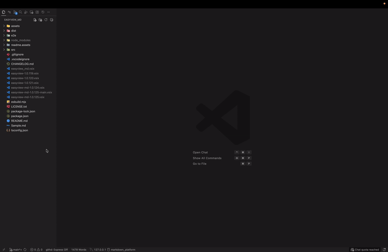
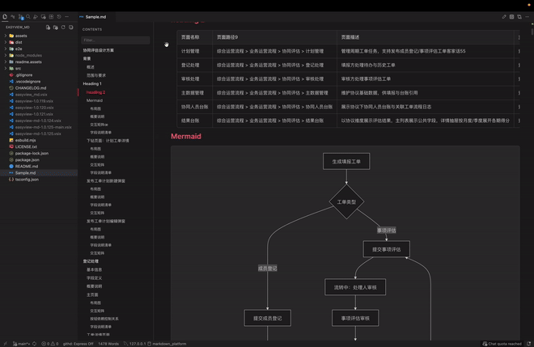
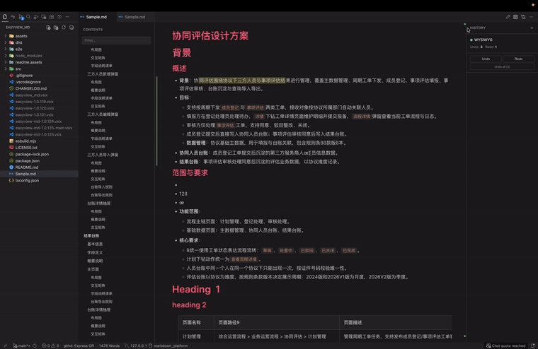

# EasyView_Md - VS Code 与桌面端 Markdown 可视化编辑器

[English](./README.md) | [简体中文](./README.zh-CN.md)

EasyView_Md 同时提供 VS Code/Cursor 插件和 Electron 桌面 APP。两种产品形态共用同一套编辑器内核、Markdown 序列化、表格能力和导出能力。

## Monorepo 目录架构

```text
apps/vscode-extension   VS Code/Cursor 插件产品及 VSIX 清单
apps/desktop            macOS、Windows Electron 桌面产品
packages/editor-core    纯浏览器编辑器、扩展、控制器和 UI
packages/markdown-core  平台无关的 Markdown 解析、模型和转换
packages/contracts      跨端消息、能力接口、结果和运行校验契约
packages/node-runtime   Git、终端、导出、转换和文件 Node 运行时
tests/e2e               编辑器、扩展宿主和桌面运行测试
tests/fixtures          两端共用测试文档与样本
resources               公共品牌、演示、字体和运行样式源文件
tooling                  架构、维护和品牌资源工具
```

仓库根目录只负责编排。插件与桌面端的产品清单、版本、构建产物和打包规则均位于各自的 `apps/*` 工作区；两端必须复用公共包，不复制编辑器和宿主能力。

```bash
npm run build                 # 构建 VS Code 插件
npm run build:desktop         # 构建 Electron APP
npm run package:vscode        # 在 apps/vscode-extension 生成 VSIX
npm run package:desktop       # 生成 Electron APP 包
npm run verify:quick          # 类型、架构边界、构建和单元测试
npm run verify:vscode         # 扩展宿主和 VSIX 验证
npm run verify:desktop        # 桌面端验证
```

## 桌面 APP

桌面 APP 可在 macOS、Windows 上脱离 VS Code 独立运行，支持 Markdown 可视化编辑、内置源码模式、文件打开/保存/重命名、本地图片资源、HTML/PDF/DOCX/XLSX 导出、Git 文件操作和内置终端。

```bash
npm install
npm run start:desktop
npm run test:e2e:desktop
npm run package:desktop
```

生成平台安装产物：

```bash
npm run make:desktop        # macOS ZIP 或 Windows ZIP/Squirrel
npm run make:desktop:mac    # macOS ZIP 和 DMG
```

桌面端源码和平台说明位于 `apps/desktop`。当前本地桌面构建属于开发产物，尚未进行代码签名和 macOS 公证。VS Code 原生编辑器集成功能继续由插件形态提供。

## 示例

### 演示一



### 演示二



### 演示三



## 2.0.0 更新内容

- **Word 转 Markdown**：在 `.docx` 或 `.doc` 文件上右键，选择 `Convert to Markdown with EasyView_Md`。生成的 Markdown 位于源文件同级目录，图片提取至对应的 `.assets` 目录。
- **Word 图片稳定转换**：保留 Word 图片的尺寸属性；带透明通道的 PNG 自动合成为白色背景，避免预览出现透明底。
- **图片粘贴资源化**：在 VS Code 原生编辑器粘贴含 Base64 图片的 Markdown 或 HTML 时，图片会自动保存到当前文档的 `.assets` 目录，并替换为相对路径。
- **图片富文本复制**：复制包含图片的选中内容时，剪贴板保留格式化 HTML 并内嵌图片，可直接粘贴到其他富文本编辑器。
- **DOCX 与 PDF 导出优化**：DOCX 导出中 H1-H4 标题使用黑色加粗，正文连续行不再产生视觉空白段；PDF 使用内置中文与符号字体，提升中文、Emoji、图表和特殊字符的兼容性。
- **自动更新提醒**：安装新版并激活插件后，通过 VS Code 原生消息提示更新，并可跳转查看更新说明。首次安装只记录版本，不弹窗打扰。

## 编辑能力

- **原生编辑器兼容**：无需可视化编辑时，Markdown 文件可继续使用 VS Code 原生文本编辑器打开。
- **原生 Markdown 装饰**：在 VS Code 编辑器中提供轻量级的行内格式展示。
- **可视化编辑**：支持完整 Markdown 序列化的所见即所得编辑。
- **源码模式**：使用 CodeMirror 6 编辑原始 Markdown，快捷键 `Ctrl+/` 或 macOS `Option+Q`。
- **自动保存**：与 VS Code 文档生命周期一致。
- **深浅色主题、缩放与全宽模式**：缩放范围 50% 至 200%。
- **历史记录与 Git 暂存**：可从顶部工具栏打开历史记录或暂存当前文件。
- **文本色系主题**：支持默认、蓝色、橙红、绿色、紫色、樱桃红。
- **斜杠菜单**：在空行输入 `/`，可快速插入 30 多种块类型。
- **浮动工具栏、块拖拽、查找替换、撤销重做**。

## 顶部工具栏

### 左侧

- 目录树显示/隐藏：`Option+W`
- 全部标题展开/收起
- 全宽模式：`Option+A`
- 表格自动换行：`Option+D`
- 缩放控制：50% 至 200%，点击百分比可恢复 100%，支持 `Ctrl/Cmd + 鼠标滚轮`

### 右侧

- 滚动到顶部：`Option+↑`
- 滚动到底部：`Option+↓`
- 暂存当前文件：`Option+S`
- 历史记录面板
- 原生源码模式：`Ctrl+/` 或 `Option+Q`
- 导出菜单：HTML、PDF、DOCX
- 深浅色模式切换：`Option+R`
- 文本色系选择

## Markdown 元素

### 文本格式

| 格式 | 语法 | 快捷键 |
| --- | --- | --- |
| 加粗 | `**文本**` | `Ctrl+B` |
| 斜体 | `*文本*` | `Ctrl+I` |
| 下划线 | `<u>文本</u>` | `Ctrl+U` |
| 删除线 | `~~文本~~` | `Ctrl+D` |
| 行内代码 | `` `code` `` | `Ctrl+E` |
| 高亮 | `==文本==` | `Ctrl+Shift+H` |
| 链接 | `[文本](https://example.com)` | `Ctrl+K` |

### 标题、列表和代码块

- 支持 H1 至 H6 标题、标题折叠、锚点链接、拖拽标识与层级标识。
- 支持无序列表、有序列表、任务列表和描述列表；可使用 Tab / Shift+Tab 调整层级。
- 支持 70 多种代码语言的语法高亮、语言选择、行号与一键复制；`Plain text` 代码块自动隐藏行号。
- 支持引用块、五种提示块（Note、Tip、Important、Caution、Warning）、分割线、脚注、前置元数据、目录和 Emoji。

### 表格

- 插入、删除、移动行列；合并和拆分单元格；切换表头。
- 列对齐（左、中、右）、列排序、行列选择和拖拽操作。
- 表格内自动换行开关和 CSV 导出。
- 关键字标签：`TRUE`、`FALSE`、`NULL`、`N/A`、`Yes`、`No` 等。

### 数学公式与图表

- KaTeX / LaTeX：行内公式 `$E = mc^2$` 和块公式 `$$...$$`。
- Mermaid：流程图、时序图、甘特图等，支持主题适配并可导出。
- 支持 PlantUML、Graphviz DOT、D2、BPMN 等流程图渲染。

### 图片

- 支持从文件系统拖拽、从剪贴板粘贴、通过 URL 或文件选择器插入。
- 图片工具栏支持查看大图、调整宽高等操作。
- 在原生编辑器粘贴 Base64 Markdown/HTML 图片时，自动写入文档 `.assets` 目录并使用相对引用。
- 复制带图片的选中内容时，保留富文本格式和图片，便于粘贴到其他编辑器。
- 支持 PNG、JPEG、GIF、SVG、WebP、BMP、ICO。

### Word 转 Markdown

1. 在 VS Code Explorer 中右键 `.docx` 或 `.doc` 文件。
2. 选择 **Convert to Markdown with EasyView_Md**。
3. 插件在源文件同级目录创建 Markdown 文件，并将图片保存到 `<文档名>.assets`。
4. 转换完成后选择 **Open Markdown**，即可使用 EasyView_Md 打开。

转换会保留标题、表格、图片替代文本和尺寸。透明 PNG 会自动转换为白色不透明背景。`.docx` 转换需要安装 [Pandoc](https://pandoc.org/)；旧版 `.doc` 还需要 LibreOffice（`soffice`）。

## 左侧目录树

- 根据文档标题自动生成并实时更新。
- 支持点击定位、按层级显示、展开/收起标题节点。
- 固定状态栏显示字符数、原始 Markdown 行号和当前选中字符数。
- 选中文本后可复制相对位置或完整文件路径与大纲路径。

## 导出

### HTML

- 独立 HTML 文件，包含内嵌 CSS。
- 支持深色和浅色主题。
- 保留代码高亮、Mermaid、数学公式、脚注、图片和前置元数据。

### PDF

- 使用 pdfmake 直接生成深色或浅色 PDF。
- 支持代码高亮、Mermaid、数学公式、图片、页码和宽表格横向页面。
- 内置中文和符号字体，提升中文、Emoji 与特殊字符的输出兼容性。

### DOCX

- 从导出菜单将 Markdown 导出为 DOCX。
- H1-H4 标题导出为黑色加粗标题。
- 正文连续行保持换行，不产生多余空白段。
- 图片尺寸属性（例如 `{width=357}`）会被正确解析，不会以文本形式出现在 Word 中。

### CSV

- 从表格操作工具栏导出任意表格。
- 根据系统区域自动选择逗号或分号，也可通过 `easyviewMd.csvDelimiter` 配置。
- UTF-8 BOM 保证 Excel 中中文显示正常。

## AI 与变更识别

- 识别外部工具（包括 AI 助手）对文档块的修改。
- 修改或新增内容显示边缘标记与滚动条标记。
- 正在变化的内容提供渐变动画和变更汇总跳转。

## VS Code 集成

- Markdown 默认仍使用 VS Code 原生文本编辑器。
- 需要可视化编辑时，使用 **Open with EasyView_Md**。

### 命令

| 命令 | 说明 |
| --- | --- |
| `Open with EasyView_Md` | 使用可选的可视化编辑器打开当前 Markdown 文件 |
| `Convert to Markdown with EasyView_Md` | 在 Explorer 中将 `.docx` 或 `.doc` 转换为 Markdown |
| `Export to HTML (Light)` | 导出浅色 HTML |
| `Export to HTML (Dark)` | 导出深色 HTML |
| `Export to PDF (Light)` | 导出浅色 PDF |
| `Export to PDF (Dark)` | 导出深色 PDF |

### 支持的文件类型

- `.md`
- `.markdown`
- `.mdx`

## 设置

| 设置项 | 说明 | 默认值 |
| --- | --- | --- |
| `easyviewMd.csvDelimiter` | CSV 分隔符：`,`、`;` 或 `auto` | `auto` |
| `easyviewMd.nativeDecorations.enabled` | 启用原生编辑器中的轻量 Markdown 装饰 | `true` |
| `easyviewMd.nativeDecorations.mermaid.enabled` | 启用原生编辑器中的安全 Mermaid 预览 | `false` |
| `easyviewMd.nativeDecorations.tables.enabled` | 启用保守的 Markdown 表格样式 | `true` |
| `easyviewMd.nativeEditor.forceMonospaceFont` | 保持中文等宽语言默认字体，同时尊重用户和工作区显式字体设置 | `true` |

### 单文件设置

在 Markdown 顶部添加 HTML 注释：

```markdown
<!-- fullWidth: true tocVisible: true tableWrap: false -->
```

- `fullWidth`：全宽显示
- `tocVisible`：显示目录树
- `tableWrap`：表格内容自动换行

## 快捷键

| 操作 | 快捷键 |
| --- | --- |
| 加粗 / 斜体 / 下划线 | `Ctrl+B` / `Ctrl+I` / `Ctrl+U` |
| 删除线 / 行内代码 / 高亮 | `Ctrl+D` / `Ctrl+E` / `Ctrl+Shift+H` |
| 链接 | `Ctrl+K` |
| H1-H4 | `Ctrl+Shift+1` 至 `Ctrl+Shift+4` |
| 查找与替换 | `Ctrl+F` |
| 源码模式 | `Ctrl+/` 或 `Option+Q` |
| 目录树 | `Ctrl+Shift+T` 或 `Option+W` |
| 全宽模式 | `Option+A` |
| 表格自动换行 | `Option+D` |
| 深浅色切换 | `Option+R` |
| 暂存当前文件 | `Option+S` |
| 滚动到顶部 / 底部 | `Option+↑` / `Option+↓` |
| 上移 / 下移块 | `Ctrl+Alt+↑` / `Ctrl+Alt+↓` |
| 强制换行 | `Shift+Enter` |
| 斜杠菜单 | `/` |
| 保存 | `Ctrl+S` |

## 致谢

EasyView_Md 基于 **Markdown Inline Editor (CodeSmith)** 继续开发，感谢原作者提供的基础编辑器架构与实现。

## 许可证

本项目采用 MIT License。完整内容请见 [LICENSE.txt](./LICENSE.txt)。
