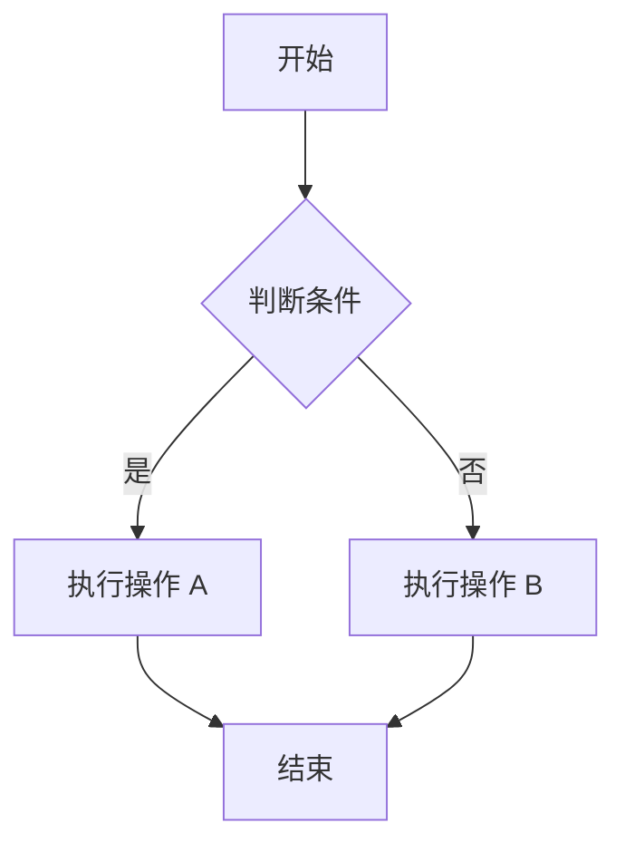
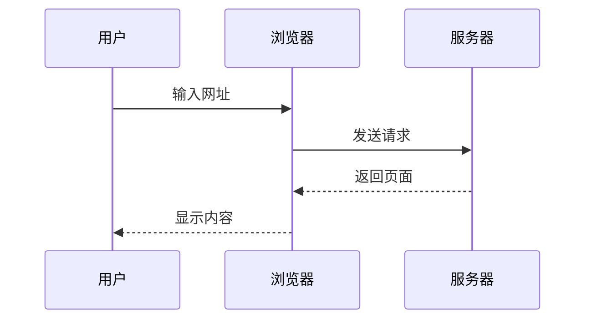
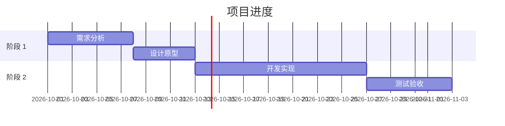

[[_TOC_]]

# EasyView 格式演示文档

欢迎使用 **EasyView**！本文档展示了 EasyView 支持的各种 Markdown 格式和功能。

## 文本格式

EasyView 支持丰富的文本格式：

- **粗体文本** 使用 `**粗体**` 或 `__粗体__`
- *斜体文本* 使用 `*斜体*` 或 `_斜体_`
- <u>下划线文本</u> 使用 `<u>下划线</u>`
- ~~删除线文本~~ 使用 `~~删除线~~`
- ==高亮文本== 使用 `==高亮==`
- `行内代码` 使用反引号包裹

你也可以**组合使用*这些格式***来创建更丰富的样式。

## 标题层级

EasyView 支持六级标题，并提供标题折叠、锚点链接和拖拽功能。

### 三级标题示例

#### 四级标题示例

##### 五级标题示例

###### 六级标题示例

## 列表

### 无序列表

- 第一项
- 第二项
  - 嵌套项 2.1
  - 嵌套项 2.2
    - 更深层嵌套 2.2.1
- 第三项

### 有序列表

1. 第一步
2. 第二步
   1. 子步骤 2.1
   2. 子步骤 2.2
3. 第三步

### 任务列表

- [x] 已完成的任务
- [x] 编写文档
- [ ] 待完成的任务
- [ ] 录制演示视频

### 描述列表

术语 1

:   这是术语 1 的定义说明

术语 2

:   这是术语 2 的第一个定义

:   这是术语 2 的第二个定义

## 引用块

> 这是一个引用块。
>
> 引用块可以包含**格式化文本**和多个段落。
>
> > 引用块也可以嵌套使用。

## 折叠区域

<details>
<summary>点击展开查看更多内容</summary>

这是折叠区域内的内容。你可以在这里放置任何 Markdown 内容：

- 列表项
- **格式化文本**
- 代码等

</details>

## 表格

EasyView 提供强大的表格功能，支持插入、删除、移动行列，合并和拆分单元格，列对齐和排序。

<table>
<tr><th align="left">功能</th><th align="center">支持情况</th><th align="right">说明</th></tr>
<tr data-easyview-row-height="47"><td align="left">单元格合并</td><td data-easyview-merge-group="evm:1:1:6:2:0:1" align="center">TRUE</td><td align="right">支持合并和拆分</td></tr>
<tr><td align="left">列对齐</td><td data-easyview-merge-group="evm:1:1:6:2:0:1" align="center">TRUE</td><td align="right">左对齐、居中、右对齐</td></tr>
<tr><td align="left">行列操作</td><td data-easyview-merge-group="evm:1:1:6:2:0:1" align="center">TRUE</td><td align="right">插入、删除、移动</td></tr>
<tr><td align="left">自动换行</td><td data-easyview-merge-group="evm:1:1:6:2:0:1" align="center">TRUE</td><td align="right">可通过工具栏切换</td></tr>
<tr><td align="left">CSV 导出</td><td data-easyview-merge-group="evm:1:1:6:2:0:1" align="center">TRUE</td><td align="right">支持自定义分隔符</td></tr>
<tr><td align="left">关键字标签</td><td align="center">N/A</td><td align="right">自动识别特殊值</td></tr>
</table>

关键字标签示例：

| 状态    | 值    | 布尔值 | 其他  |
| ----- | ---- | --- | --- |
| TRUE  | NULL | Yes | N/A |
| FALSE | 0    | No  | \-  |

## 分隔线

使用三个或更多的连字符、星号或下划线创建分隔线：

---

## 代码块

EasyView 支持 70+ 种编程语言的语法高亮、行号显示和一键复制：

```python
def hello_world():
    """这是一个简单的 Python 函数"""
    print("你好，世界！")
    return True

if __name__ == "__main__":
    hello_world()
```

```javascript
// JavaScript 示例
function fibonacci(n) {
  if (n <= 1) return n;
  return fibonacci(n - 1) + fibonacci(n - 2);
}

console.log(fibonacci(10));
```

```sql
-- SQL 查询示例
SELECT 
    users.name,
    COUNT(orders.id) as order_count
FROM users
LEFT JOIN orders ON users.id = orders.user_id
GROUP BY users.name
HAVING order_count > 5
ORDER BY order_count DESC;
```

## 流程图

EasyView 支持 Mermaid 图表，并且可以导出为图片：



时序图示例：



甘特图示例：



## 数学公式

EasyView 使用 KaTeX 渲染数学公式。

### 行内公式

爱因斯坦的质能方程：$E = mc^2$

勾股定理：$a^2 + b^2 = c^2$

### 公式块

$$
\int_0^\infty e^{-x^2} dx = \frac{\sqrt{\pi}}{2}
$$

矩阵表示：

$$
\begin{bmatrix}
a & b \\
c & d
\end{bmatrix}
\begin{bmatrix}
x \\
y
\end{bmatrix}
=
\begin{bmatrix}
ax + by \\
cx + dy
\end{bmatrix}
$$

傅里叶变换：

$$
F(\omega) = \int_{-\infty}^{\infty} f(t) e^{-i\omega t} dt
$$

## 提示块

EasyView 支持五种提示块样式：

> [!note]
> 这是一个注释提示块。用于提供补充说明和参考信息。

> [!tip]
> 这是一个技巧提示块。用于分享有用的提示和建议。

> [!important]
> 这是一个重要提示块。用于强调关键信息和要点。

> [!caution]
> 这是一个警示提示块。用于提醒可能存在的问题。

> [!warning]
> 这是一个警告提示块。用于标注需要特别注意的内容。

## 链接

### 普通链接

访问 [EasyView GitHub 仓库](https://github.com/tiantianmanmanzou/EasyView_Md) 了解更多信息。

### 自动链接

[https://github.com/tiantianmanmanzou/EasyView_Md](https://github.com/tiantianmanmanzou/EasyView_Md)

### 锚点链接

跳转到[文本格式](#文本格式)章节。

## 脚注

EasyView 支持脚注功能[^1]，你可以在文档中添加引用和注释[^2]。

## 图片

你可以通过多种方式插入图片：

1. 从文件系统拖拽
2. 从剪贴板粘贴
3. 使用 URL 引用
4. 通过文件选择器

图片工具栏支持查看大图、调整尺寸等操作。EasyView 支持 PNG、JPEG、GIF、SVG、WebP、BMP、ICO 等格式。

## HTML 内容

EasyView 允许嵌入 HTML 代码块：

<div style="padding: 1em; background: linear-gradient(135deg, #667eea 0%, #764ba2 100%); color: white; border-radius: 8px; text-align: center;">
  <h3 style="margin: 0;">自定义样式的 HTML 块</h3>
  <p style="margin: 0.5em 0 0 0;">你可以使用 HTML 创建特殊的视觉效果</p>
</div>

<!-- 这是一个 HTML 注释，不会在渲染时显示 -->

## Emoji 支持

EasyView 支持 Emoji 表情：😀 🎉 ⭐ 💻 📝 🚀 ✨ 🎨 🔥 💡

## 支持的非 Markdown 文件类型

除了 Markdown 编辑，EasyView 还可以预览和处理多种文件格式：

### 文本文件

- 纯文本 (`.txt`, `.log`)
- 配置文件 (`.json`, `.jsonc`, `.yaml`, `.yml`, `.xml`, `.ini`, `.conf`, `.properties`, `.toml`)
- 表格数据 (`.csv`, `.tsv`)

### 图片文件

- 常见格式：PNG, JPEG, GIF, WebP, BMP, ICO, TIFF
- 矢量图：SVG
- macOS 图标：ICNS

### 文档文件

- HTML (`.html`, `.htm`)
- PDF (`.pdf`)

### Microsoft Office 文件

- Word：`.docx`, `.docm`, `.dotx`, `.dotm`, `.doc`
- Excel：`.xlsx`, `.xlsm`, `.xlsb`, `.xls`, `.ods`
- PowerPoint：`.pptx`, `.pptm`, `.potx`, `.potm`, `.ppsx`, `.ppsm`, `.ppt`

### 压缩文件

- ZIP, JAR, WAR, EAR, VSIX, APK, CBZ
- TAR, TAR.GZ, TGZ, GZ
- 7Z, RAR, CBR

### 其他格式

- 思维导图：`.xmind`

### 文件转换

EasyView 还支持将 Word 和 PDF 文件转换为 Markdown：

1. 在文件资源管理器中右键点击 `.docx`, `.doc` 或 `.pdf` 文件
2. 选择 **Convert to Markdown with EasyView_Md**
3. 自动生成 Markdown 文件和提取的图片资源

## 导出功能

EasyView 提供多种导出格式：

- **HTML**：独立的 HTML 文件，支持深色和浅色主题
- **PDF**：使用内置中文字体，支持代码高亮和图表
- **DOCX**：Microsoft Word 格式，保留标题样式和格式
- **CSV**：从表格导出，支持自定义分隔符

---

**提示**：按 `Ctrl+/`（macOS: `Option+Q`）可切换到源码模式查看原始 Markdown。

**关于本文档**：本演示文档涵盖了 EasyView 的主要功能和格式支持。在空行输入 `/` 可打开斜杠菜单，快速插入 30+ 种块类型。

[^1]: 这是第一个脚注的内容。

[^2]: 这是第二个脚注，可以包含**格式化文本**和[链接](https://example.com)。

<!-- easyview:table-meta {"version":1,"tables":[{"shape":[3,3,3,3,3,3,3],"cells":[],"rowHeights":[0,47,0,0,0,0,0]}]} -->
