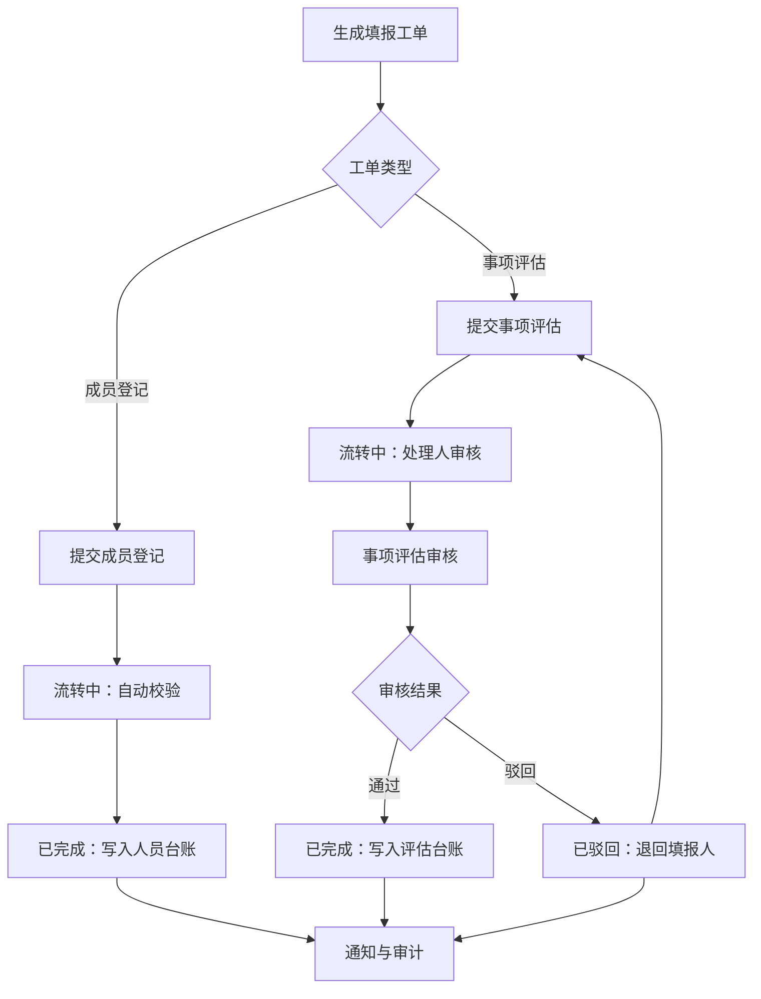

# 协同评估设计方案

# 背景

## 概述

- **背景**：协==同评估围绕协议下三方人员与事项评估结==果进行管理，覆盖主数据管理、周期工单下发、成员登记、事项评估填报、事项评估审核、台账沉淀与查询导入导出。
- **目标**：
  - 支持按周期下发`成员登记`与`事项评估`两类工单，接收对象按协议所属部门自动关联人员。
  - 填报方在登记处理页处理待办，`详情`下钻工单详情页面维护明细并提交报备，`流程详情`弹窗查看当前工单流程与日志。
  - 审核方仅处理`事项评估`工单，支持同意、驳回整改、关闭。
  - 成员登记提交后直接写入协同人员台账；事项评估审核同意后写入结果台账。
  - 主数据管理作为填报与台账关联的基础数据，支持增删改查、导入、导出。<br>
    ads

  问
  - 主流程页面支持计划管理、登记处理、审核处理，基础数据页面支持主数据管理、协同人员台账、结果台账。
  - 敖德萨的
  - 主lkj
- - 客家话
  - 

协同工单、߆

œ林俊杰

1œads

阿德åΩΩœœ<br>
是的<br>
协同部工单计划∂∂∂∂∑∑∑∑名词解释

œœœ

- **==工单计划==**==：用于周期生成工单任务的计划对象，包含工单类型、协议选择、接收组织、接收成员、周期配置、生效时间与计划状态。==
- **†工单**：由工单计划生成的任务实例，类型分为`成员登记`与`事项评估`。
  - 大方ß
  - œœ
  - ßß当前协议评分
    - 主数据管理员\\阿德<br>
      ads
- ß

密码

- **当前处置方**：表示待办归属角色，仅用于按钮权限与待办路由判断，不作为工单状态。
- **主数据管理**：协议基础主数据，用于填报与台账关联，包含规则条ßß款版ß本。
- **协同人员台账**：成员登记工单提交后沉淀的第三方服务商人œ∑员信息数据。
- **结果台账**：事项评估审核处理同意后沉淀的评估业务数据，以协议维度记录。

## 范围与要求

- 
- 12ß
- œ
- **功能范围**：
  - 流程主链页面：计划管理、登记处理、审核处理。
  - 基础数据页面：主数据管理、协同人员台账、结果台账。
- **核心要求**：
  - ß统一使用工单状态表达流程流转：`草稿`、`处置中`、`已驳回`、`已关闭`、`已完成`。
  - 计划下钻动作统一为`查看流程详情`。
  - 人员台账中同一个人在同一个协议下只能出现一次，按证件号码校验唯一性。
  - 评估台账以协议为维度，按规则条款版本决定展示周期：2024版和2026V1版为月度，2026V2版为季度。

统一用流程包括的流程：草稿、处置中、已驳

客家话

了

连接

# Heading  1

## heading 2

| 页面名称   | 页面路径9                           | 页面描述                                   | 主要栏目                | 数据流向                                                | 包含元素                                    | 其他                             |
| ------ | ------------------------------- | -------------------------------------- | ------------------- | --------------------------------------------------- | --------------------------------------- | ------------------------------ |
| 计划管理   | 综合运营流程 > 业务运营流程 > 协同评估 > 计划管理   | 管理周期工单任务，支持发布成员登记/事项评估工单客家话55          | 查询筛选、计划列表、二级工单列表、分页 | 计划配置 -> 周期生成工单 -> 待办分发 -> 执行回写                      | 列表、发布弹窗、计划详情、二级工单下钻                     | 接收组织关联成员                       |
| 登记处理   | 综合运营流程 > 业务运营流程 > 协同评估 > 登记处理   | 填报方处理待办与历史工单                           | 查询筛选、工单列表、分页        | 计划工单 -> 下钻工单详情维护明细并提交报备 / 打开流程详情弹窗查看轨迹 -> 人员台账或审核待办 | 列表、工单详情页面、流程详情弹窗                        | 仅处理既有计划生成工单                    |
| 审核处理   | 综合运营流程 > 业务运营流程 > 协同评估 > 审核处理   | 审核方处理事项评估工单                            | 查询筛选、审核列表、分页        | 事项评估提交 -> 审核处置 -> 结果台账                              | 列表、审批管理抽屉                               | 仅展示事项评估工单                      |
| 主数据管理  | 综合运营流程 > 业务运营流程 > 协同评估 > 主数据管理  | 维护协议基础数据，供填报与台账引用                      | 查询筛选、协议列表、导入导出、分页   | 协议维护 -> 填报引用 -> 台账关联                                | 列表、新建弹窗、编辑弹窗、导入弹窗、详情抽屉                  | 支持增删改查、导入、导出                   |
| 协同人员台账 | 综合运营流程 > 业务运营流程 > 协同评估 > 协同人员台账 | 展示协议下协同人员台账与关联工单流程日志                   | 查询筛选、人员列表、导入导出、分页   | 成员登记提交/手工导入 -> 台账写入/更新                              | 列表、详情抽屉、新增弹窗、编辑弹窗、导入弹窗、导出               | 证件号唯一性校验，同人同协议仅一次              |
| 结果台账   | 综合运营流程 > 业务运营流程 > 协同评估 > 结果台账   | 以协议维度展示评估结果，主列表展示公共字段，详情抽屉按月度/季度展开各期得分 | 查询筛选、协议评估列表、分页      | 审核同意 -> 台账写入/更新 -> 管理得分维护                           | 列表（协议维度，公共字段）、详情抽屉（周期分列得分明细、管理部门得分双击编辑） | 每个周期内按两个部门并列展示，底部同步展示得分小计与平均得分 |

## Mermaid



### 布局图

```text
┌───────────────────────────────────────────────────────────────────────────────────────────────────────────────────────────────────────────┐
│ 综合运营流程 > 业务运营流程 > 协同评估 > 计划管理                                                                                         │
│ 计划管理                                                                                                                                  │
├───────────────────────────────────────────────────────────────────────────────────────────────────────────────────────────────────────────┤
│ 计划名称:<_____> 工单类型:<全部▼> 接收对象:<全部▼> 计划状态:<全部▼> 周期类型:<全部▼> [搜索] [重置]                     [发布工单计划] │
│ 生效开始时间:<____-__-__> 生效截止时间:<____-__-__>                                                                                       │
├───────────────────────────────────────────────────────────────────────────────────────────────────────────────────────────────────────────┤
│ ┌─────────────┬──────────┬──────────────┬───────────┬───────────────┬─────────────┬─────────────┬──────────┬────────────┐                 │
│ │ 计划名称    │ 工单类型 │ 接收对象     │ 周期/cron │ 计划创建时间  │ 生效开始时间│ 生效截止时间│ 计划状态 │ 操作       │                 │
│ ├═════════════╪══════════╪══════════════╪═══════════╪═══════════════╪═════════════╪═════════════╪══════════╪════════════┤                 │
│ │ ▼ 月度巡检 │ 成员登记 │ 示例组织(11人) │ 月        │ 2026-05-07... │ 2026-01-01  │ 2026-12-31  │ 启用     │ [查看]   │                 │
│ │   ┌──────────┬──────────┬───────────────┬──────────┬──────────┬────────────────┐                                      │                 │
│ │   │ 工单序号 │ 工单名称 │ 工单创建时间  │ 工单状态 │ 完成情况 │ 操作           │                                      │                 │
│ │   ├══════════╪══════════╪═══════════════╪══════════╪══════════╪════════════════┤                                      │                 │
│ │   │ 1        │ 计划A_01 │ 2026-05-07... │ 处置中   │ 8/11     │ [查看流程详情] │                                      │                 │
│ │   │ 2        │ 计划A_02 │ 2026-05-07... │ 已完成   │ 11/11    │ [查看流程详情] │                                      │                 │
│ │   │ 3        │ 计划A_03 │ 2026-05-08... │ 草稿     │ 0/11     │ [查看流程详情] │                                      │                 │
│ │   │ 4        │ 计划A_04 │ 2026-05-08... │ 处置中   │ 6/11     │ [查看流程详情] │                                      │                 │
│ │   │ 5        │ 计划A_05 │ 2026-05-09... │ 已完成   │ 11/11    │ [查看流程详情] │                                      │                 │
│ │   └──────────┴──────────┴───────────────┴──────────┴──────────┴────────────────┘                                      │                 │
│ │ ▼ 季度评估 │ 事项评估 │ 示例项目组     │ 季        │ 2026-05-07... │ 2026-01-01  │ 2026-03-31  │ 启用     │ [查看]   │                 │
│ │ ▼ 专项复核 │ 成员登记 │ 安全服务组   │ cron      │ 2026-05-08... │ 2026-01-01  │ 2026-06-30  │ 停用     │ [查看]     │                 │
│ │ ▼ 年度评估 │ 事项评估 │ 重点项目组   │ 年        │ 2026-05-08... │ 2026-01-01  │ 2026-12-31  │ 已终止   │ [查看]     │                 │
│ │ ▼ 临时排查 │ 成员登记 │ 运维外包组   │ 周        │ 2026-05-09... │ 2026-05-01  │ 2026-05-31  │ 启用     │ [查看]     │                 │
│ └─────────────┴──────────┴──────────────┴───────────┴───────────────┴─────────────┴─────────────┴──────────┴────────────┘                 │
├───────────────────────────────────────────────────────────────────────────────────────────────────────────────────────────────────────────┤
│                                                                                                         每页[20▼] 共<90>条 < 1 2 3 ... > │
└───────────────────────────────────────────────────────────────────────────────────────────────────────────────────────────────────────────┘
```

### 概要说明

- 查询筛选区：计划名称、工单类型、接收组织、计划状态、周期类型、生效开始时间、生效截止时间；按钮：搜索、重置。
- 页面操作区：发布工单计划。
- 计划列表区：计划主列表，支持展开二级工单列表；计划操作：查看、编辑、启用/停用/终止。
- 二级工单列表区：工单序号、工单名称、工单创建时间、工单状态、完成情况；操作：查看流程详情。
- 分页区：页码、每页条数、总数。

### 交互矩阵œ

| 交互点     | 可点击条件        | 行为约束                 | 页面反馈/状态变化  | 异常/边界       |
| ------- | ------------ | -------------------- | ---------- | ----------- |
| 页面初始化   | 进入页面         | 默认按计划创建时间降序加载计划列表    | 列表加载并渲染    | 加载失败提示并允许重试 |
| 搜索      | 点击`搜索`       | 按筛选条件查询计划列表，分页回到第一页  | 列表刷新       | 无匹配显示空状态    |
| 重置      | 点击`重置`       | 清空筛选条件后重新查询          | 列表刷新       | \-          |
| 展开计划行   | 点击展开控件       | 按当前排序加载该计划二级工单列表     | 展示或收起二级列表  | 无工单显示空状态    |
| 查看计划    | 点击`查看`       | 只读展示计划详情与执行统计        | 打开详情抽屉     | 拉取失败提示      |
| 编辑计划    | 点击`编辑`且计划状态允许 | 回填计划配置进入编辑模式         | 打开发布弹窗     | 状态不允许时禁用    |
| 启用/停用计划 | 点击`启用/停用`且状态允许 | 仅影响后续工单生成，不回滚已生成工单   | 刷新计划状态     | 权限不足或状态冲突提示 |
| 终止计划    | 点击`终止`且状态允许  | 永久停止后续工单生成，不回滚已生成工单  | 刷新计划状态为已终止 | 权限不足或状态冲突提示 |
| 发布工单计划  | 点击`发布工单计划`   | 新建计划并写入接收成员快照        | 打开发布弹窗     | \-          |
| 查看流程详情  | 点击二级工单`查看流程详情` | 进入该工单只读流程详情，不进入填报编辑页 | 跳转下钻页      | 权限不足提示      |
| 分页切换    | 切换页码或页大小     | 按分页参数刷新列表            | 列表刷新       | \-          |

### 字段说明清单

| 所属区域  | 字段名     | 字段ID                | 字段属性 | 类型/控件  | 必填/校验 | 默认值 | 来源/备注              |
| ----- | ------- | ------------------- | ---- | ------ | ----- | --- | ------------------ |
| 查询筛选区 | 计划名称    | plan_name           | 业务字段 | input  | 非必填   | 空   | 模糊匹配               |
| 查询筛选区 | 工单类型    | ticket_type         | 业务字段 | select | 非必填   | 全部  | 成员登记/事项评估          |
| 查询筛选区 | 接收组织    | receive_org         | 业务字段 | select | 非必填   | 全部  | 来源组织管理             |
| 查询筛选区 | 计划状态    | plan_status         | 业务字段 | select | 非必填   | 全部  | 启用/停用/已终止          |
| 查询筛选区 | 周期类型    | cycle_type          | 业务字段 | select | 非必填   | 全部  | 周/月/年/cron         |
| 查询筛选区 | 生效开始时间  | effective_start     | 业务字段 | date   | 非必填   | 空   | 起始日期               |
| 查询筛选区 | 生效截止时间  | effective_end       | 业务字段 | date   | 非必填   | 空   | 截止日期               |
| 列表区   | 计划名称    | plan_name           | 业务字段 | column | \-    | \-  | 计划主标识              |
| 列表区   | 工单类型    | ticket_type         | 业务字段 | column | \-    | \-  | 成员登记/事项评估          |
| 列表区   | 接收对象    | receiver            | 业务字段 | column | \-    | \-  | 组织名+人数，成员见详情       |
| 列表区   | 周期/cron | cycle_rule          | 业务字段 | column | \-    | \-  | 周期或cron表达式         |
| 列表区   | 计划创建时间  | created_time        | 系统字段 | column | \-    | 降序  | 系统生成               |
| 列表区   | 生效开始时间  | effective_start     | 业务字段 | column | \-    | \-  | 生效起始日期             |
| 列表区   | 生效截止时间  | effective_end       | 业务字段 | column | \-    | \-  | 生效截止日期             |
| 列表区   | 计划状态    | plan_status         | 业务字段 | tag    | \-    | \-  | 启用/停用/已终止          |
| 二级列表区 | 工单序号    | ticket_seq          | 系统字段 | column | \-    | \-  | 计划内自增              |
| 二级列表区 | 工单名称    | ticket_name         | 系统字段 | column | \-    | \-  | 计划名称\_序号           |
| 二级列表区 | 工单创建时间  | ticket_created_time | 系统字段 | column | \-    | \-  | 系统生成               |
| 二级列表区 | 工单状态    | ticket_status       | 流程字段 | tag    | \-    | \-  | 草稿/处置中/已驳回/已关闭/已完成 |
| 二级列表区 | 完成情况    | completion          | 计算字段 | column | \-    | \-  | 已填报数/总数            |

## 下钻页面：计划工单详情

### 布局图

```text
┌──────────────────────────────────────────────────────────────────────────────────────────────────────┐
│ 首页 > 综合运营流程 > 业务运营流程 > 协同评估 > 计划管理 > 工单详情                                  │
│ < 返回  工单详情                                                                                     │
├──────────────────────────────────────────────────────────────────────────────────────────────────────┤
│ 接收人明细                                                                                           │
│ 接收人:<_____> 工单状态:<全部▼> 提交时间:<_____~_____> [搜索] [重置]                                │
│ ┌──────┬────────┬──────────┬──────────┬────────────┬────────┬────────────────┐                       │
│ │ 序号 │ 接收人 │ 所属组织 │ 工单状态 │ 提交时间   │ 处置人 │ 操作           │                       │
│ ├══════╪════════╪══════════╪══════════╪════════════╪════════╪════════════════┤                       │
│ │ 1    │ 成员A  │ 示例组织 │ 已完成   │ 2026-05... │ 成员B  │ [查看流程详情] │                       │
│ │ 2    │ 成员B  │ 示例组织 │ 处置中   │ 2026-05... │ 成员C  │ [查看流程详情] │                       │
│ │ 3    │ 成员C  │ 示例组织 │ 草稿     │ 2026-05... │ 成员A  │ [查看流程详情] │                       │
│ │ 4    │ 成员D  │ 示例组织 │ 已完成   │ 2026-05... │ 成员B  │ [查看流程详情] │                       │
│ │ 5    │ 成员E  │ 示例组织 │ 处置中   │ 2026-05... │ 成员C  │ [查看流程详情] │                       │
│ └──────┴────────┴──────────┴──────────┴────────────┴────────┴────────────────┘                       │
│                                                                    每页[20▼] 共<90>条 < 1 2 3 ... > │
└──────────────────────────────────────────────────────────────────────────────────────────────────────┘
```

### 概要说明

- 查看某一计划生成工单的接收人明细，按接收人查看工单状态与提交情况。
- 接收人明细行操作统一为`查看流程详情`，进入该接收人工单详情页。
- **输入**：工单批次ID、接收人筛选条件、状态筛选条件、提交时间范围。
- **处理**：按筛选条件查询接收人明细。
- **输出**：接收人执行明细。

### 交互矩阵

| 交互点    | 可点击条件    | 行为约束         | 页面反馈/状态变化 | 异常/边界    |
| ------ | -------- | ------------ | --------- | -------- |
| 页面初始化  | 进入下钻页    | 加载接收人明细列表    | 页面渲染      | 加载失败提示重试 |
| 搜索     | 点击`搜索`   | 按筛选条件查询接收人明细 | 列表刷新      | 无匹配显示空状态 |
| 重置     | 点击`重置`   | 清空筛选条件并刷新    | 列表刷新      | \-       |
| 查看流程详情 | 点击`查看流程详情` | 跳转至该接收人工单详情页 | 跳转详情页     | 权限不足提示   |

### 字段说明清单

| 所属区域   | 字段名  | 字段ID                 | 字段属性 | 类型/控件     | 必填/校验 | 默认值 | 来源/备注              |
| ------ | ---- | -------------------- | ---- | --------- | ----- | --- | ------------------ |
| 接收人明细区 | 接收人  | receiver_name        | 业务字段 | input     | 非必填   | 空   | 模糊匹配               |
| 接收人明细区 | 工单状态 | ticket_status        | 流程字段 | select    | 非必填   | 全部  | 草稿/处置中/已驳回/已关闭/已完成 |
| 接收人明细区 | 提交时间 | submitted_time_range | 系统字段 | daterange | 非必填   | 空   | 时间范围               |
| 接收人明细区 | 操作   | row_actions          | 流程字段 | action    | \-    | \-  | 查看流程详情             |

## 发布工单计划新建弹窗

### 布局图

```text
┌────────────────────────────────────────────────────────────────────────────────────────────────────┐
│ 发布工单计划（新建）                                                                           [x] │
├────────────────────────────────────────────────────────────────────────────────────────────────────┤
│ *计划名称: <_____>       *工单类型: <成员登记▼>                                                   │
│ *评估协议: <选择协议▼>                                                                            │
│ *周期类型: <月▼>         cron表达式: <_____>                                                      │
│ *生效开始: <____-__-__>  *生效截止: <____-__-__>                                                   │
│ *接收组织: <_____▼>                                                                               │
│ *接收成员: [成员A] [成员B] [成员C] （随评估协议自动带出，可手工增删）                              │
├────────────────────────────────────────────────────────────────────────────────────────────────────┤
│                                                                           [取消] [保存草稿] [发布] │
└────────────────────────────────────────────────────────────────────────────────────────────────────┘
```

### 概要说明

- 仅用于新建计划。
- 工单类型为事项评估时需选择评估协议，系统自动关联协议所属部门下的接收人员列表；支持取消选中或追加人员。
- 接收组织与接收成员联动：选择接收组织后自动加载该组织下成员，至少保留1个接收成员。
- 周期类型为`cron`时必须填写合法cron表达式。

### 字段说明清单

| 所属区域 | 字段名     | 字段ID                 | 字段属性 | 类型/控件         | 必填/校验               | 默认值  | 来源/备注                      |
| ---- | ------- | -------------------- | ---- | ------------- | ------------------- | ---- | -------------------------- |
| 表单区  | 计划名称    | plan_name            | 业务字段 | input         | 必填，<=100字符          | 空    | 唯一性按业务规则校验                 |
| 表单区  | 工单类型    | ticket_type          | 业务字段 | select        | 必填                  | 成员登记 | 成员登记/事项评估                  |
| 表单区  | 评估协议    | assessment_contracts | 业务字段 | cascader/tags | ticket_type=事项评估时必填 | 空    | 来源主数据管理；选择后自动关联协议所属部门下接收人员 |
| 表单区  | 周期类型    | cycle_type           | 业务字段 | select        | 必填                  | 月    | 周/月/年/cron                 |
| 表单区  | cron表达式 | cron_expr            | 业务字段 | input         | cycle_type=cron时必填  | 空    | 合法性校验                      |
| 表单区  | 生效开始    | effective_start      | 业务字段 | date          | 必填                  | 空    | 不能晚于生效截止                   |
| 表单区  | 生效截止    | effective_end        | 业务字段 | date          | 必填                  | 空    | 不能早于生效开始                   |
| 表单区  | 接收组织    | receive_org          | 业务字段 | select        | 必填                  | 空    | 来源组织管理；选择后自动加载接收成员         |
| 表单区  | 接收成员    | receiver             | 业务字段 | tags          | 必填，>=1              | 自动带出 | 随接收组织或评估协议联动；可手工移除或追加成员    |

### 交互矩阵

| 交互点    | 可点击条件          | 行为约束                       | 页面反馈/状态变化     | 异常/边界       |
| ------ | -------------- | -------------------------- | ------------- | ----------- |
| 打开弹窗   | 点击`发布工单计划`     | 初始化空白表单并按默认值渲染             | 弹窗打开          | 初始化失败提示     |
| 选择工单类型 | 切换工单类型         | 事项评估类型时显示评估协议选择器；成员登记类型时隐藏 | 评估协议区域显示/隐藏   | \-          |
| 选择评估协议 | 工单类型=事项评估且选择协议 | 自动加载协议所属部门下成员列表            | 接收成员标签更新      | 协议下无人员时提示   |
| 选择接收组织 | 选择组织项          | 自动加载该组织下成员列表               | 接收成员标签更新      | 组织无成员时提示    |
| 删除成员   | 点击成员标签删除       | 发布前成员数必须>=1                | 成员数量更新        | 成员为0时阻止提交   |
| 发布     | 点击`发布`且校验通过    | 新建计划并持久化成员                 | 提交成功关闭弹窗并刷新列表 | 校验失败提示并保留输入 |
| 取消     | 点击`取消`或`×`     | 放弃未提交变更                    | 弹窗关闭          | \-          |

## 发布工单计划编辑弹窗

### 布局图

```text
┌────────────────────────────────────────────────────────────────────────────────────────────────────┐
│ 发布工单计划（编辑）                                                                           [x] │
├────────────────────────────────────────────────────────────────────────────────────────────────────┤
│ *计划名称: <_____>       *工单类型: <成员登记▼>                                                   │
│ *评估协议: <选择协议▼>                                                                            │
│ *周期类型: <月▼>         cron表达式: <_____>                                                      │
│ *生效开始: <____-__-__>  *生效截止: <____-__-__>                                                   │
│ *接收组织: <_____▼>                                                                               │
│ *接收成员: [成员A] [成员B] [成员C] （随评估协议自动带出，可手工增删）                              │
├────────────────────────────────────────────────────────────────────────────────────────────────────┤
│                                                                           [取消] [保存草稿] [保存] │
└────────────────────────────────────────────────────────────────────────────────────────────────────┘
```

### 概要说明

- 仅用于编辑既有计划，打开时回填原计划配置。
- 计划状态为`已终止`时仅支持只读查看，不允许保存。
- 接收组织与接收成员联动：切换接收组织后自动刷新该组织下成员列表。
- 周期类型为`cron`时必须填写合法cron表达式。

### 字段说明清单

| 所属区域 | 字段名     | 字段ID                 | 字段属性 | 类型/控件         | 必填/校验               | 默认值  | 来源/备注                   |
| ---- | ------- | -------------------- | ---- | ------------- | ------------------- | ---- | ----------------------- |
| 表单区  | 计划名称    | plan_name            | 业务字段 | input         | 必填，<=100字符          | 回填原值 |                         |
| 表单区  | 工单类型    | ticket_type          | 业务字段 | select        | 必填                  | 回填原值 | 成员登记/事项评估               |
| 表单区  | 评估协议    | assessment_contracts | 业务字段 | cascader/tags | ticket_type=事项评估时必填 | 回填原值 | 来源主数据管理；切换后自动刷新关联人员     |
| 表单区  | 周期类型    | cycle_type           | 业务字段 | select        | 必填                  | 回填原值 | 周/月/年/cron              |
| 表单区  | cron表达式 | cron_expr            | 业务字段 | input         | cycle_type=cron时必填  | 回填原值 | 合法性校验                   |
| 表单区  | 生效开始    | effective_start      | 业务字段 | date          | 必填                  | 回填原值 | 不能晚于生效截止                |
| 表单区  | 生效截止    | effective_end        | 业务字段 | date          | 必填                  | 回填原值 | 不能早于生效开始                |
| 表单区  | 接收组织    | receive_org          | 业务字段 | select        | 必填                  | 回填原值 | 来源组织管理；切换后自动刷新接收成员      |
| 表单区  | 接收成员    | receiver             | 业务字段 | tags          | 必填，>=1              | 回填原值 | 随接收组织或评估协议联动；可手工移除或追加成员 |

### 交互矩阵

| 交互点    | 可点击条件            | 行为约束          | 页面反馈/状态变化     | 异常/边界       |
| ------ | ---------------- | ------------- | ------------- | ----------- |
| 打开弹窗   | 点击`编辑`且计划状态允许    | 回填计划配置进入编辑模式  | 弹窗打开          | 回填失败提示      |
| 选择评估协议 | 工单类型=事项评估且修改协议选择 | 自动刷新关联协议下成员列表 | 接收成员标签更新      | 协议下无人员时提示   |
| 选择接收组织 | 选择组织项            | 自动加载该组织下成员列表  | 接收成员标签更新      | 组织无成员时提示    |
| 删除成员   | 点击成员标签删除         | 保存前成员数必须>=1   | 成员数量更新        | 成员为0时阻止提交   |
| 保存     | 点击`保存`且校验通过      | 更新计划并持久化成员    | 保存成功关闭弹窗并刷新列表 | 校验失败提示并保留输入 |
| 取消     | 点击`取消`或`×`       | 放弃未提交变更       | 弹窗关闭          | \-          |

# 登记处理

## 基本信息

- **页面标题**：登记处理
- **页面路径**：综合运营流程 > 业务运营流程 > 协同评估 > 登记处理
- **页面角色**：填报方

## 字段定义

| 字段名     | 字段ID               | 类型       | 控件            | 格式校验              | 枚举值说明                      | 备注                                |
| ------- | ------------------ | -------- | ------------- | ----------------- | -------------------------- | --------------------------------- |
| 工单名称    | ticket_name        | string   | input/column  | 查询非必填，模糊匹配        | \-                         | 工单主展示字段                           |
| 工单编号    | ticket_id          | string   | column/text   | 系统生成，只读           | \-                         | 主列表与详情基本信息                        |
| 工单类型    | ticket_type        | enum     | column/text   | 系统生成，只读           | 成员登记 / 事项评估                | 决定详情页数据列与默认搜索字段                   |
| 工单状态    | ticket_status      | enum     | select/tag    | 查询非必填             | 草稿 / 处置中 / 已驳回 / 已关闭 / 已完成 | 主列表流程状态                           |
| 派单人     | dispatch_user      | string   | column/text   | 系统生成，只读           | \-                         | 详情基本信息                            |
| 派单时间    | dispatch_time      | datetime | column/text   | 系统生成，只读           | \-                         | 详情基本信息                            |
| 处置人     | current_handler    | string   | column/text   | 系统生成，只读           | \-                         | 主列表与详情基本信息                        |
| 协议编号    | contract_code      | string   | column        | 系统生成，只读           | \-                         | 事项评估工单的评估协议编号                     |
| 协议名称    | contract_name      | string   | column        | 系统生成，只读           | \-                         | 事项评估工单的评估协议名称                     |
| 规则条款版本  | assessment_version | enum     | column        | 系统生成，只读           | 2024 / 2026V1 / 2026V2     | 决定评估扣分项内容                         |
| 人员姓名    | person_name        | string   | input/column  | 成员登记明细必填，<=50字符   | \-                         | 成员登记数据字段                          |
| 人员类型    | person_type        | enum     | select/column | 成员登记明细必填          | 驻场/远程                      | 成员登记数据字段                          |
| 联系电话    | phone              | string   | input/column  | 成员登记明细必填，手机号/电话格式 | \-                         | 成员登记数据字段                          |
| 服务商名称   | vendor_name        | string   | input/column  | 成员登记明细必填，<=100字符  | \-                         | 成员登记数据字段                          |
| 附件      | attachments        | array    | upload/column | 成员登记明细非必填，格式校验    | \-                         | 成员登记与事项评估附件字段                     |
| 录入时间    | created_time       | datetime | column        | 系统生成              | \-                         | 明细基础字段                            |
| 更新时间    | updated_time       | datetime | column        | 系统生成              | \-                         | 明细基础字段                            |
| 协议基本信息  | contract_info      | object   | readonly      | 系统生成，只读           | \-                         | 事项评估详情页展示协议基本信息区块                 |
| 评估扣分项列表 | assessment_items   | array    | table form    | 按规则条款版本填充         | \-                         | 每条扣分项包含：类别、指标、服务质量要点及考评标准、扣分值(必填) |
| 得分小计    | total_score        | int      | readonly      | 100-所有扣分值之和       | \-                         | 事项评估详情页实时计算展示                     |

## 概要说明

- 填报方查看待办与历史工单，主列表操作统一为`详情`、`流程详情`。
- 点击`详情`下钻至工单详情页面：
  - 成员登记类型：在详情页维护人员明细并执行`提交报备`，提交后直接写入台账无需审核。
  - 事项评估类型：在详情页展示协议基本信息和评估扣分表，逐项录入扣分值后执行`提交报备`，提交后流转至审核方。
- 点击`流程详情`打开流程详情弹窗，查看当前工单流程图与操作日志。
- 工单来源仅为计划生成，主列表不提供`编辑`、`处置`、`删除`相关操作。
- 事项评估详情页以抽屉形式展示协议基本信息与评估扣分表，得分小计实时计算（100-所有扣分值之和）。
- **输入**：主列表查询条件、事项评估扣分值录入、人员明细新增/导入数据、附件、提交报备动作。
- **处理**：
  - 主列表加载工单并按操作栏下钻详情页。
  - 详情页按工单类型加载对应内容：成员登记为明细列表；事项评估为协议信息+评估扣分表。
  - 成员登记工单提交报备后写入/更新协同人员台账（无需审核）。
  - 事项评估工单提交报备后流转审核待办。
- **输出**：工单列表、工单基本信息、协议基本信息与评估扣分表（事项评估）、明细数据列表（成员登记）、报备提交结果、台账写入结果、站内通知。

## 主页面

### 布局图

```text
┌────────────────────────────────────────────────────────────────────────────────────────────────────────────────────────────────┐
│ 综合运营流程 > 业务运营流程 > 协同评估 > 登记处理                                                                              │
│ 登记处理                                                                                                                       │
├────────────────────────────────────────────────────────────────────────────────────────────────────────────────────────────────┤
│ 工单名称:<_____> 工单状态:<全部▼> 工单创建时间:<_____~_____> [搜索] [重置]                                                    │
├────────────────────────────────────────────────────────────────────────────────────────────────────────────────────────────────┤
│ ┌──────────┬────────────┬────────────┬────────┬──────────┬──────────┬────────┬───────────────────┐                             │
│ │ 工单名称 │ 工单编号   │ 工单创...  │ 接收人 │ 工单类型 │ 工单状态 │ 处置人 │ 操作              │                             │
│ ├══════════╪════════════╪════════════╪════════╪══════════╪══════════╪════════╪═══════════════════┤                             │
│ │ 月度填报 │ T250507001 │ 2026-05... │ 成员A  │ 成员登记 │ 草稿     │ 成员A  │ [详情] [流程详情] │                             │
│ │ 事项评估 │ T250507002 │ 2026-05... │ 成员B  │ 事项评估 │ 处置中   │ 成员B  │ [详情] [流程详情] │                             │
│ │ 人员复核 │ T250507003 │ 2026-05... │ 成员C  │ 成员登记 │ 已完成   │ 成员C  │ [详情] [流程详情] │                             │
│ │ 整改补充 │ T250507004 │ 2026-05... │ 成员D  │ 事项评估 │ 已驳回   │ 成员D  │ [详情] [流程详情] │                             │
│ │ 临时填报 │ T250507005 │ 2026-05... │ 成员E  │ 成员登记 │ 已关闭   │ 成员E  │ [详情] [流程详情] │                             │
│ └──────────┴────────────┴────────────┴────────┴──────────┴──────────┴────────┴───────────────────┘                             │
├────────────────────────────────────────────────────────────────────────────────────────────────────────────────────────────────┤
│                                                                                              每页[20▼] 共<90>条 < 1 2 3 ... > │
└────────────────────────────────────────────────────────────────────────────────────────────────────────────────────────────────┘
```

### 交互矩阵

| 交互点   | 可点击条件    | 行为约束              | 页面反馈/状态变化 | 异常/边界      |
| ----- | -------- | ----------------- | --------- | ---------- |
| 页面初始化 | 进入页面     | 默认加载当前填报方可见工单     | 列表渲染      | 加载失败提示重试   |
| 搜索    | 点击`搜索`   | 按筛选条件查询工单，分页回到第一页 | 列表刷新      | 无匹配显示空状态   |
| 重置    | 点击`重置`   | 清空筛选条件后重查         | 列表刷新      | \-         |
| 详情    | 点击`详情`   | 下钻至工单详情页面         | 页面跳转      | 详情加载失败提示重试 |
| 流程详情  | 点击`流程详情` | 打开当前工单流程详情弹窗      | 弹窗打开      | 拉取失败提示重试   |
| 分页    | 切换页码/页大小 | 按分页参数查询           | 列表刷新      | \-         |

### 按钮依赖控制关系

| 按钮   | 可点击条件 | 说明         |
| ---- | ----- | ---------- |
| 详情   | 总是可点击 | 下钻工单详情页面   |
| 流程详情 | 总是可点击 | 打开流程图与日志弹窗 |

### 字段说明清单

| 所属区域  | 字段名    | 字段ID               | 字段属性 | 类型/控件     | 必填/校验 | 默认值 | 来源/备注              |
| ----- | ------ | ------------------ | ---- | --------- | ----- | --- | ------------------ |
| 查询筛选区 | 工单名称   | ticket_name        | 业务字段 | input     | 非必填   | 空   | 模糊匹配               |
| 查询筛选区 | 工单类型   | ticket_type        | 业务字段 | select    | 非必填   | 全部  | 成员登记/事项评估          |
| 查询筛选区 | 工单状态   | ticket_status      | 流程字段 | select    | 非必填   | 全部  | 草稿/处置中/已驳回/已关闭/已完成 |
| 查询筛选区 | 工单创建时间 | created_time_range | 系统字段 | daterange | 非必填   | 空   | 时间范围               |
| 列表区   | 工单名称   | ticket_name        | 业务字段 | column    | \-    | \-  | 工单数据               |
| 列表区   | 工单编号   | ticket_id          | 系统字段 | column    | \-    | \-  | 系统生成               |
| 列表区   | 工单创建时间 | created_time       | 系统字段 | column    | \-    | \-  | 系统生成               |
| 列表区   | 接收人    | applicant          | 系统字段 | column    | \-    | \-  | 系统生成               |
| 列表区   | 工单类型   | ticket_type        | 业务字段 | column    | \-    | \-  | 成员登记/事项评估          |
| 列表区   | 工单状态   | ticket_status      | 流程字段 | tag       | \-    | \-  | 草稿/处置中/已驳回/已关闭/已完成 |
| 列表区   | 处置人    | current_handler    | 流程字段 | column    | \-    | \-  | 当前待办归属             |
| 列表区   | 操作     | row_actions        | 流程字段 | action    | \-    | \-  | 详情/流程详情            |

## 工单详情页面

### 布局图

#### 成员登记类型

```text
┌─────────────────────────────────────────────────────────────────────────────────────────────────────────────────────────────────────────┐
│ 登记处理 > 工单详情                                                                                                        [< 返回列表] │
├─────────────────────────────────────────────────────────────────────────────────────────────────────────────────────────────────────────┤
│ ▉ 工单基本信息                                                                                                               [提交报备] │
│ 工单编号: T250507001        工单类型: 成员登记        派单人: 成员A                                                                     │
│ 派单时间: 2026-05-07 10:00:00        处置人: 成员B                                                                                      │
│                                                                                                                                         │
│ ▉ 数据列表                                                                                                                              │
│ 人员姓名:<_____>  人员类型:<全部▼>  联系电话:<_____>                                                        [过滤] [搜索] [清除筛选值] │
│                                                                                       [新增] [导入] [导出] [下载模板] [批量删除] [清空] │
│ ┌─────┬──────┬──────────┬──────────┬────────────┬────────────┬────────────┬────────────┬────────────┬──────────────────────────┐        │
│ │ [ ] │ 序号 │ 人员姓名 │ 人员类型 │ 联系电话   │ 服务商名称 │ 附件       │ 录入时间   │ 更新时间   │ 操作                     │        │
│ ├═════╪══════╪══════════╪══════════╪════════════╪════════════╪════════════╪════════════╪════════════╪══════════════════════════┤        │
│ │ [ ] │ 1    │ 成员A    │ 驻场人员 │ 1380000... │ 服务商A    │ 附件1.pdf  │ 2026-05... │ 2026-05... │ [编辑] [删除] [下载附件] │        │
│ │ [ ] │ 2    │ 成员B    │ 外包人员 │ 1390000... │ 服务商B    │ -          │ 2026-05... │ 2026-05... │ [编辑] [删除]            │        │
│ │ [ ] │ 3    │ 成员C    │ 测试人员 │ 1370000... │ 服务商C    │ 附件2.zip  │ 2026-05... │ 2026-05... │ [编辑] [删除] [下载附件] │        │
│ │ [ ] │ 4    │ 成员D    │ 开发人员 │ 1360000... │ 服务商D    │ -          │ 2026-05... │ 2026-05... │ [编辑] [删除]            │        │
│ │ [ ] │ 5    │ 成员E    │ 运维人员 │ 1350000... │ 服务商E    │ 附件3.docx │ 2026-05... │ 2026-05... │ [编辑] [删除] [下载附件] │        │
│ └─────┴──────┴──────────┴──────────┴────────────┴────────────┴────────────┴────────────┴────────────┴──────────────────────────┘        │
│                                                                                                       每页[20▼] 共<90>条 < 1 2 3 ... > │
└─────────────────────────────────────────────────────────────────────────────────────────────────────────────────────────────────────────┘
```

#### 事项评估类型11

1212

事项评估工单的填报采用**详情抽屉**承载，不采用独立详情页面。抽屉内展示协议基本信息和评估扣分表，由填报方逐项录入扣分值后提交。

```text
┌─────────────────────────────────────────────────────────────────────────────────────────────────────────────────────────────────────┐
│ 登记处理 - 评估填报详情（抽屉）                                                                                                     │
├─────────────────────────────────────────────────────────────────────────────────────────────────────────────────────────────────────┤
│ ▉ 协议基本信息                                                                                                                      │
│ 协议编号:[XY-2026-001]  协议名称:[业务安全服务协议]  相对方名称:[示例科技有限公司]                                                  │
│ 履行开始:[2026-01-01]   履行结束:[2026-12-31]      需求部门:[业务管理部]    项目经理:[成员A]                                        │
│ 规则条款版本:[2026V2]   得分小计:[90]（=100 - 所有扣分项之和）                                                           [提交报备] │
├─────────────────────────────────────────────────────────────────────────────────────────────────────────────────────────────────────┤
│ ▉ 评估扣分项                                                                                                                        │
│ ┌───────────┬───────────┬───────────┬────────┐                                                                                      │
│ │ 类别      │ 指标      │ 服务质... │ 扣分值 │                                                                                      │
│ ├═══════════╪═══════════╪═══════════╪════════┤                                                                                      │
│ │ 一、服... │ 工作质... │ 乙方应... │ < 0>   │                                                                                      │
│ │           │ 工作目... │ 乙方工... │ < 3>   │                                                                                      │
│ │           │ 服务承诺  │ 乙方应... │ < 0>   │                                                                                      │
│ │ 二、服... │ 服务响... │ 对于紧... │ < 0>   │                                                                                      │
│ │           │ 问题解... │ 乙方应... │ < 0>   │                                                                                      │
│ │ 三、人... │ 人员资... │ 乙方应... │ < 0>   │                                                                                      │
│ │           │ 定期培训  │ 乙方应... │ < 2>   │                                                                                      │
│ │ ...       │ ...       │ ...       │ ...    │                                                                                      │
│ │ 九、负... │ 安全生... │ 1.一级... │ < 5>   │                                                                                      │
│ │           │ 信息安... │ 因乙方... │ < 0>   │                                                                                      │
│ │           │ 监管通报  │ 1.被上... │ < 0>   │                                                                                      │
│ └───────────┴───────────┴───────────┴────────┘                                                                                      │
│ 得分小计: 90 = 100 - 10                                                                                                             │
└─────────────────────────────────────────────────────────────────────────────────────────────────────────────────────────────────────┘
```

> **说明**：评估扣分项内容根据协议绑定的**规则条款版本**（2024 / 2026V1 / 2026V2）从附录《规则条款细则》加载对应版本的扣分项列表。扣分项列表可滚动查看，得分小计在表尾和协议基本信息区同步实时计算。

### 概要说明

- 成员登记类型：`详情`进入独立详情页面，不再使用编辑弹窗、处置弹窗或详情抽屉作为主承载页面。
- 事项评估类型：`详情`打开**详情抽屉**，抽屉内展示协议基本信息和评估扣分表。
- 页面/抽屉结构：
  - 成员登记：上方为`工单基本信息`+`提交报备`按钮，下方为`数据列表`；
  - 事项评估：抽屉顶部为`协议基本信息`+`提交报备`+`得分小计`，下方为`评估扣分表`。
- 成员登记数据列表行操作提供`编辑`、`删除`，其中`编辑`仅在工单状态为`草稿`或`已驳回`时可用。
- 事项评估的评估扣分表根据协议的`规则条款版本`（2024/2026V1/2026V2）加载对应版本的扣分项（详见附录《规则条款细则》），每条扣分项包含：类别、指标、服务质量要点及考评标准、扣分值输入框。得分小计 = 100 - 所有扣分值之和，在表尾和协议基本信息区同步实时计算。
- 数据列表根据工单类型切换：
  - 成员登记：字段为`人员姓名`、`人员类型`、`联系电话`、`服务商名称`、`附件`，以及`录入时间`、`更新时间`等基础字段。
- `录入时间`为系统字段，在新增单条明细或导入明细时自动记录当前时间；`更新时间`为系统字段，在编辑明细提交成功后自动刷新为当前时间。
- 成员登记搜索栏默认显示`人员姓名`、`人员类型`、`联系电话`；事项评估抽屉无搜索栏，仅展示评估扣分表单。
- 数据表为宽表格样式，支持横向滚动，操作列位于表格右侧。
- 如果数据表存在`附件`字段且当前行附件有值，则操作列显示`下载附件`按钮；无附件时不显示该按钮。
- 附件仅支持在新增、编辑弹窗中上传，并在数据列表操作列按条下载；导入、导出、下载模板均不支持附件文件的导入与下载。
- 点击`提交报备`时执行校验：
  - 成员登记校验通过后提交报备并写入/更新协同人员台账（无需审核）。
  - 事项评估校验通过（扣分值须为非负整数且得分小计>=0）后提交报备并流转至审核方待办。

### 交互矩阵

**成员登记类型**

| 交互点   | 可点击条件              | 行为约束                | 页面反馈/状态变化   | 异常/边界                  |
| ----- | ------------------ | ------------------- | ----------- | ---------------------- |
| 页面初始化 | 从主列表点击`详情`进入       | 拉取工单基本信息与人员明细列表     | 页面渲染        | 加载失败提示重试               |
| 过滤    | 点击`过滤`             | 展开或收起更多筛选项          | 筛选区展开/收起    | 无扩展条件时保持默认 3 项         |
| 搜索    | 点击`搜索`             | 按人员姓名、人员类型、联系电话检索明细 | 列表刷新        | 无匹配显示空状态               |
| 清除筛选值 | 点击`清除筛选值`          | 清空当前搜索栏与已展开筛选条件     | 列表刷新        | \-                     |
| 新增    | 点击`新增`             | 新增 1 条人员明细记录        | 新增成功后刷新列表   | 必填项校验失败阻止保存；证件号协议内重复提示 |
| 编辑    | 工单状态为`草稿`或`已驳回`时点击单行`编辑` | 修改人员明细记录            | 保存成功后刷新列表   | 非可编辑状态不显示或不可点击         |
| 删除    | 点击单行`删除`           | 删除当前明细记录            | 删除成功后刷新列表   | 二次确认                   |
| 下载附件  | 当前行附件有值时点击`下载附件`   | 下载当前行附件文件           | 浏览器下载       | 附件缺失或文件失效提示            |
| 导入    | 点击`导入`             | 按人员模板批量导入明细         | 导入完成后刷新列表   | 模板不符或字段错误提示失败行         |
| 导出    | 点击`导出`             | 导出当前工单下人员明细数据       | 浏览器下载       | 无数据时提示不可导出             |
| 下载模板  | 点击`下载模板`           | 下载人员导入模板            | 浏览器下载       | 模板生成失败提示重试             |
| 批量删除  | 勾选数据后点击`批量删除`      | 删除勾选明细数据            | 删除成功后刷新列表   | 未勾选时提示先选择数据            |
| 清空    | 点击`清空`             | 清空当前工单下全部人员明细       | 清空成功后刷新列表   | 二次确认                   |
| 提交报备  | 点击`提交报备`           | 校验通过后提交并写入人员台账      | 提交成功后刷新工单状态 | 必填项缺失或证件重复提示           |
| 分页    | 切换页码/页大小           | 按分页参数查询             | 列表刷新        | \-                     |

**事项评估类型（抽屉）**

| 交互点   | 可点击条件      | 行为约束                        | 页面反馈/状态变化        | 异常/边界           |
| ----- | ---------- | --------------------------- | ---------------- | --------------- |
| 抽屉打开  | 从主列表点击`详情`进入 | 拉取协议基本信息与评估扣分表（按协议规则条款版本加载） | 抽屉打开并渲染          | 加载失败提示重试        |
| 录入扣分值 | 打开抽屉后      | 逐项录入扣分值，须为非负整数；得分小计实时计算     | 扣分值字段更新，得分小计同步刷新 | 扣分值为空时提交校验提示    |
| 提交报备  | 点击`提交报备`   | 校验所有扣分值合法（非负整数）且得分小计>=0后提交  | 提交成功后关闭抽屉并刷新工单列表 | 校验失败高亮未填写项      |
| 关闭抽屉  | 点击`×`      | 未提交时放弃本次录入                  | 抽屉关闭             | 已录入未保存内容切换前提示确认 |

### 字段说明清单

#### 工单基本信息区

| 字段名  | 字段ID            | 字段属性 | 类型/控件  | 必填/校验      | 默认值     | 来源/备注     |
| ---- | --------------- | ---- | ------ | ---------- | ------- | --------- |
| 工单编号 | ticket_id       | 系统字段 | text   | 只读         | 系统生成    | 工单唯一标识    |
| 工单类型 | ticket_type     | 业务字段 | text   | 只读         | 工单生成时确定 | 成员登记/事项评估 |
| 派单人  | dispatch_user   | 系统字段 | text   | 只读         | 工单派发人   | 基本信息展示    |
| 派单时间 | dispatch_time   | 系统字段 | text   | 只读         | 系统生成    | 基本信息展示    |
| 处置人  | current_handler | 流程字段 | text   | 只读         | 当前待办归属  | 基本信息展示    |
| 提交报备 | submit_report   | 页面动作 | button | 点击前执行完整性校验 | \-      | 详情页右上角主按钮 |

#### 成员登记数据列表

| 字段名   | 字段ID         | 字段属性 | 类型/控件         | 必填/校验       | 默认值 | 来源/备注                         |
| ----- | ------------ | ---- | ------------- | ----------- | --- | ----------------------------- |
| 人员姓名  | person_name  | 业务字段 | input/column  | 必填，<=50字符   | 空   | 默认搜索字段                        |
| 人员类型  | person_type  | 业务字段 | select/column | 必填          | 空   | 默认搜索字段，枚举值：驻场/远程              |
| 联系电话  | phone        | 业务字段 | input/column  | 必填，手机号/电话格式 | 空   | 默认搜索字段                        |
| 服务商名称 | vendor_name  | 业务字段 | input/column  | 必填，<=100字符  | 空   | 业务字段                          |
| 附件    | attachments  | 业务字段 | upload/column | 非必填，格式校验    | 空   | 仅支持新增/编辑上传与列表按条下载，不支持导入导出附件文件 |
| 录入时间  | created_time | 系统字段 | column        | 系统生成        | \-  | 新增或导入时自动记录当前时间                |
| 更新时间  | updated_time | 系统字段 | column        | 系统生成        | \-  | 编辑提交成功后自动更新当前时间               |

#### 事项评估扣分表

| 字段名         | 字段ID                 | 字段属性 | 类型/控件        | 必填/校验   | 默认值                    | 来源/备注                          |
| ----------- | -------------------- | ---- | ------------ | ------- | ---------------------- | ------------------------------ |
| 协议编号        | contract_code        | 业务字段 | text         | 只读      | 工单关联的评估协议              | 从工单计划带入                        |
| 协议名称        | contract_name        | 业务字段 | text         | 只读      | 工单关联的评估协议              | 从工单计划带入                        |
| 相对方名称       | counterparty_name    | 业务字段 | text         | 只读      | 从协议数据获取                | 协议基本信息展示                       |
| 履行开始时间      | contract_start_date  | 业务字段 | text         | 只读      | 从协议数据获取                | 协议基本信息展示                       |
| 履行结束时间      | contract_end_date    | 业务字段 | text         | 只读      | 从协议数据获取                | 协议基本信息展示                       |
| 需求部门        | demand_department    | 业务字段 | text         | 只读      | 从协议数据获取                | 协议基本信息展示                       |
| 项目经理        | project_manager_name | 业务字段 | text         | 只读      | 从协议数据获取                | 协议基本信息展示                       |
| 规则条款版本      | assessment_version   | 业务字段 | tag          | 只读      | 从协议规则条款版本获取            | 2024 / 2026V1 / 2026V2，决定扣分项内容 |
| 得分小计        | total_score          | 计算字段 | text         | 实时计算    | 100                    | 100 - 所有扣分值之和                  |
| 类别          | item_category        | 业务字段 | text         | 只读      | 按规则条款版本加载，详见附录《规则条款细则》 | 九大类评估类别                        |
| 指标          | item_indicator       | 业务字段 | text         | 只读      | 按规则条款版本加载，详见附录《规则条款细则》 | 各评估指标名称                        |
| 服务质量要点及考评标准 | item_standard        | 业务字段 | text         | 只读      | 按规则条款版本加载，详见附录《规则条款细则》 | 考评标准说明文本，可多行展示                 |
| 扣分值         | deduction_score      | 业务字段 | input/number | 必填，非负整数 | 0                      | 填报方逐项录入；实时参与得分小计计算             |

#### 成员登记数据列表页面按钮

| 按钮   | 按钮ID              | 可点击条件     | 说明                   |
| ---- | ----------------- | --------- | -------------------- |
| 新增   | add_row           | 总是可点击     | 新增 1 条人员明细           |
| 导入   | import_rows       | 总是可点击     | 批量导入人员明细，不支持导入附件文件   |
| 导出   | export_rows       | 有明细数据时可点击 | 导出当前工单人员明细，不包含附件文件   |
| 下载模板 | download_template | 总是可点击     | 下载人员导入模板，不包含附件字段导入能力 |
| 批量删除 | batch_delete      | 勾选明细后可点击  | 删除勾选人员明细             |
| 清空   | clear_rows        | 有明细数据时可点击 | 清空当前工单全部人员明细         |

#### 成员登记数据列表行操作

| 按钮   | 按钮ID                | 可点击条件           | 说明                 |
| ---- | ------------------- | --------------- | ------------------ |
| 编辑   | edit_row            | 工单状态为`草稿`或`已驳回`时可点击 | 打开人员明细编辑弹窗，修改当前行明细 |
| 删除   | delete_row          | 总是可点击           | 删除当前行人员明细数据        |
| 下载附件 | download_attachment | 当前行附件有值时可点击     | 下载当前行附件文件          |

## 工单明细新增弹窗

> 仅适用于**成员登记**类型。事项评估类型无独立新增弹窗，评估内容通过详情抽屉内的扣分表直接填写。

### 布局图

```text
┌───────────────────────────────────────────────────────────────────────────────────────────────┐
│ 新增工单明细                                                                              [x] │
├───────────────────────────────────────────────────────────────────────────────────────────────┤
│ 成员登记类型                                                                                  │
│ *人员姓名: <_____>   *人员类型: <驻场▼>    *联系电话: <_____>                                │
│ *服务商名称: <_____>                                                                          │
│ 附件: [上传附件]                                                                              │
├───────────────────────────────────────────────────────────────────────────────────────────────┤
│                                                                                 [取消] [保存] │
└───────────────────────────────────────────────────────────────────────────────────────────────┘
```

### 概要说明

- 在成员登记工单详情页面点击`新增`打开。
- 弹窗展示成员登记字段：`人员姓名`、`人员类型`、`联系电话`、`服务商名称`、`附件`。
- 附件为选填，其他业务字段均为必填。
- 保存成功后关闭弹窗并刷新当前工单人员明细列表，自动写入`录入时间`。

### 字段说明清单

| 字段名   | 字段ID        | 字段属性 | 类型/控件  | 必填/校验       | 默认值 | 来源/备注     |
| ----- | ----------- | ---- | ------ | ----------- | --- | --------- |
| 人员姓名  | person_name | 业务字段 | input  | 必填，<=50字符   | 空   | 成员登记字段    |
| 人员类型  | person_type | 业务字段 | select | 必填          | 空   | 枚举值：驻场/远程 |
| 联系电话  | phone       | 业务字段 | input  | 必填，手机号/电话格式 | 空   | 成员登记字段    |
| 服务商名称 | vendor_name | 业务字段 | input  | 必填，<=100字符  | 空   | 成员登记字段    |
| 附件    | attachments | 业务字段 | upload | 非必填，格式校验    | 空   | 成员登记字段    |

### 交互矩阵

| 交互点  | 可点击条件     | 行为约束                | 页面反馈/状态变化 | 异常/边界      |
| ---- | --------- | ------------------- | --------- | ---------- |
| 打开弹窗 | 点击`新增`    | 初始化空白表单             | 弹窗打开      | 初始化失败提示    |
| 保存   | 点击`保存`且校验通过 | 新增 1 条人员明细，自动写入录入时间 | 关闭弹窗并刷新列表 | 校验失败提示缺失字段 |
| 取消   | 点击`取消`或`×` | 不落库                 | 关闭弹窗      | \-         |

## 工单明细编辑弹窗

### 布局图

#### 成员登记类型

```text
┌──────────────────────────────────────────────────────────────────────────────────────────────┐
│ 编辑工单明细                                                                             [x] │
├──────────────────────────────────────────────────────────────────────────────────────────────┤
│ 成员登记类型                                                                                 │
│ *人员姓名: <_____>  *人员类型: <驻场▼>  *联系电话: <_____>                                  │
│ *服务商名称: <_____>                                                                         │
│ 附件: [上传附件] [删除附件]                                                                  │
├──────────────────────────────────────────────────────────────────────────────────────────────┤
│                                                                                [取消] [提交] │
└──────────────────────────────────────────────────────────────────────────────────────────────┘
```

> 仅适用于**成员登记**类型。事项评估类型无独立编辑弹窗，评估扣分值在详情抽屉内直接修改后提交。

### 概要说明

- 在工单状态为`草稿`或`已驳回`时，点击成员登记数据列表单行`编辑`打开。
- 表单展示人员姓名、人员类型、联系电话、服务商名称和附件，打开时回填当前行数据。
- 已上传附件支持在编辑弹窗内删除；删除后以当前保存结果为准。
- 提交成功后关闭弹窗并刷新明细列表，`更新时间`同步刷新。

### 字段说明清单

| 字段名   | 字段ID        | 字段属性 | 类型/控件  | 必填/校验       | 默认值  | 来源/备注     |
| ----- | ----------- | ---- | ------ | ----------- | ---- | --------- |
| 人员姓名  | person_name | 业务字段 | input  | 必填，<=50字符   | 回填原值 | 成员登记字段    |
| 人员类型  | person_type | 业务字段 | select | 必填          | 回填原值 | 枚举值：驻场/远程 |
| 联系电话  | phone       | 业务字段 | input  | 必填，手机号/电话格式 | 回填原值 | 成员登记字段    |
| 服务商名称 | vendor_name | 业务字段 | input  | 必填，<=100字符  | 回填原值 | 成员登记字段    |
| 附件    | attachments | 业务字段 | upload | 非必填，格式校验    | 回填原值 | 支持删除已上传附件 |

### 交互矩阵

| 交互点  | 可点击条件            | 行为约束          | 页面反馈/状态变化 | 异常/边界          |
| ---- | ---------------- | ------------- | --------- | -------------- |
| 打开弹窗 | 工单状态为`草稿`或`已驳回`时点击`编辑` | 回填人员明细数据      | 弹窗打开      | 非可编辑状态不显示或不可点击 |
| 删除附件 | 当前存在已上传附件时点击`删除附件` | 删除表单中的附件引用    | 附件展示区更新   | 附件不存在时按钮不可用    |
| 提交   | 点击`提交`且校验通过      | 更新人员明细，刷新更新时间 | 关闭弹窗并刷新列表 | 并发更新提示         |
| 取消   | 点击`取消`或`×`       | 不落库           | 关闭弹窗      | \-             |

## 工单明细导入弹窗

> 仅适用于**成员登记**类型。事项评估不提供明细导入功能。

### 布局图

```text
┌──────────────────────────────────────────────────────────────────────────────────────┐
│ 工单明细导入                                                                     [x] │
├──────────────────────────────────────────────────────────────────────────────────────┤
│ 导入文件: [选择文件]                                                                 │
├──────────────────────────────────────────────────────────────────────────────────────┤
│                                                                    [取消] [确认导入] │
└──────────────────────────────────────────────────────────────────────────────────────┘
```

### 概要说明

- 在成员登记工单详情页面点击`导入`打开。
- 导入模板包含人员姓名、人员类型、联系电话、服务商名称，不包含附件字段。
- 当前弹窗内不提供`下载模板`按钮，模板下载通过数据列表页面按钮区统一触发。
- 附件文件不支持通过导入模板导入，也不随导出文件下载；附件仅支持在新增、编辑弹窗中上传，并在数据列表操作栏按条下载。
- 选择导入文件后可直接执行明细导入，导入前完成模板与字段合法性校验。
- 导入成功后关闭弹窗并刷新当前工单人员明细列表。

### 交互矩阵

| 交互点  | 可点击条件       | 行为约束                       | 页面反馈/状态变化 | 异常/边界          |
| ---- | ----------- | -------------------------- | --------- | -------------- |
| 打开弹窗 | 点击`导入`      | 初始化人员导入模板信息                | 弹窗打开      | 初始化失败提示        |
| 确认导入 | 选择文件后点击`确认导入` | 导入前自动执行模板与字段校验，通过后执行人员明细导入 | 关闭弹窗并刷新列表 | 模板不匹配或行级校验失败提示 |
| 取消   | 点击`取消`或`×`  | 不落库                        | 关闭弹窗      | \-             |

## 流程详情弹窗

### 布局图

```text
┌─────────────────────────────────────────────────────────────────────────────────────────────────────────────────┐
│ 流程详情                                                                                                    [x] │
├─────────────────────────────────────────────────────────────────────────────────────────────────────────────────┤
│ ▉ 流程图                                                                                                        │
│ ┌──────────────────────────────────────────────────────────────────────────────────────────────────────────┐    │
│ │                                  驳回整改                                                                │    │
│ │                      ┌────────────────────────────┐                                                      │    │
│ │                      v                            │                                                      │    │
│ │ 开始 --> [报备提交] --> [审批] --> <判断> --通过--> 已完成                                               │    │
│ └──────────────────────────────────────────────────────────────────────────────────────────────────────────┘    │
│                                                                                                                 │
│ ▉ 日志                                                                                                          │
│ ┌──────────────────────────────────────────────────────────────────────────────────────────────────────────┐    │
│ │ o 2026-05-07 09:30:00  操作人: 孙八                                                                      │    │
│ │ |   发起工单                                                                                             │    │
│ │ o 2026-05-07 10:00:00  操作人: approver1                                                                 │    │
│ │ |   驳回整改: 请补充附件                                                                                 │    │
│ └──────────────────────────────────────────────────────────────────────────────────────────────────────────┘    │
└─────────────────────────────────────────────────────────────────────────────────────────────────────────────────┘
```

### 概要说明

- 在登记处理主列表点击`流程详情`打开。
- 弹窗主体展示当前工单流程图与操作日志，不展示顶部工单名称、编号等基础信息栏，也不承载数据编辑、提交报备或明细维护。
- 流程图按当前工单实际状态高亮节点，支持展示驳回整改回路。
- 日志按时间倒序展示，记录时间、操作人、动作结果与说明。

### 交互矩阵

| 交互点   | 可点击条件  | 行为约束         | 页面反馈/状态变化 | 异常/边界       |
| ----- | ------ | ------------ | --------- | ----------- |
| 打开弹窗  | 点击`流程详情` | 拉取当前工单流程图与日志 | 弹窗打开      | 拉取失败提示重试    |
| 查看流程图 | 弹窗打开后  | 只读展示当前流程轨迹   | 高亮当前节点    | 流程数据缺失时显示空态 |
| 查看日志  | 弹窗打开后  | 只读展示当前工单日志   | 日志列表渲染    | 无日志时显示空态    |
| 关闭弹窗  | 点击`×`  | 不落库          | 弹窗关闭      | \-          |

# 审核处理

## 基本信息

- **页面标题**：审核处理
- **页面路径**：综合运营流程 > 业务运营流程 > 协同评估 > 审核处理
- **页面角色**：审核方

## 字段复用与增量说明

- **字段复用来源**：复用`登记处理 -> 字段定义`中的工单主字段（工单名称、工单编号、所属协议、工单状态、当前处置方、评估业务字段）。
- **本页增量/差异字段**：
  - 默认查询口径：`工单状态=处置中`且`当前处置方=审核方`。
  - 审核意见字段：`audit_comment`（驳回整改、关单时必填）。
- **状态变更规则**：
  - 审批通过：状态转`已完成`，写入/更新结果台账。
  - 驳回整改：状态转`已驳回`并切回填报方。
  - 关单：状态转`已关闭`，流程终止。

## 概要说明

- 仅展示`事项评估`工单，默认聚焦当前审核方待办。
- 主列表操作统一为`审批管理`，点击后打开审批管理抽屉，在抽屉内完成查看与审批。
- **输入**：查询条件、审批动作、审核意见。
- **处理**：查询审核工单 -> 打开审批管理抽屉 -> 查看工单与评估明细 -> 执行审批动作 -> 更新状态与待办归属 -> 同步台账。
- **输出**：审核结果、工单状态变化、结果台账写入结果、站内通知。

## 主页面

### 布局图

```text
┌───────────────────────────────────────────────────────────────────────────────────────────────────────────────────────┐
│ 综合运营流程 > 业务运营流程 > 协同评估 > 审核处理                                                                     │
│ 审核处理                                                                                                              │
├───────────────────────────────────────────────────────────────────────────────────────────────────────────────────────┤
│ 工单名称:<_____> 所属协议:<_____> 工单状态:<处置中▼> 工单创建时间:<_____~_____> [搜索] [重置]                        │
├───────────────────────────────────────────────────────────────────────────────────────────────────────────────────────┤
│ ┌──────────┬────────────┬────────────┬────────┬──────────┬──────────┬──────────┬────────┬────────────┐                │
│ │ 工单名称 │ 工单编号   │ 工单创...  │ 接收人 │ 所属协议 │ 事项评估 │ 工单状态 │ 处置人 │ 操作       │                │
│ ├══════════╪════════════╪════════════╪════════╪══════════╪══════════╪══════════╪════════╪════════════┤                │
│ │ 事项评估 │ T250507101 │ 2026-05... │ 成员A  │ XX项目A  │ ...      │ 处置中   │ 成员B  │ [审批管理] │                │
│ │ 评估复核 │ T250507102 │ 2026-05... │ 成员B  │ XX项目B  │ ...      │ 处置中   │ 成员C  │ [审批管理] │                │
│ │ 整改审核 │ T250507103 │ 2026-05... │ 成员C  │ XX项目C  │ ...      │ 处置中   │ 成员D  │ [审批管理] │                │
│ │ 专项评估 │ T250507104 │ 2026-05... │ 成员D  │ XX项目D  │ ...      │ 已完成   │ 成员E  │ [审批管理] │                │
│ │ 关闭复核 │ T250507105 │ 2026-05... │ 成员E  │ XX项目E  │ ...      │ 已关闭   │ 成员B  │ [审批管理] │                │
│ └──────────┴────────────┴────────────┴────────┴──────────┴──────────┴──────────┴────────┴────────────┘                │
│                                                                                     每页[20▼] 共<90>条 < 1 2 3 ... > │
└───────────────────────────────────────────────────────────────────────────────────────────────────────────────────────┘
```

### 交互矩阵

| 交互点   | 可点击条件    | 行为约束                   | 页面反馈/状态变化 | 异常/边界    |
| ----- | -------- | ---------------------- | --------- | -------- |
| 页面初始化 | 进入页面     | 默认查询`工单状态=处置中`且`当前处置方=审核方` | 列表渲染      | 加载失败提示重试 |
| 搜索    | 点击`搜索`   | 按筛选条件查询                | 列表刷新      | 无匹配显示空状态 |
| 重置    | 点击`重置`   | 清空筛选后重查                | 列表刷新      | \-       |
| 审批管理  | 点击`审批管理` | 打开当前工单审批管理抽屉           | 抽屉打开      | 拉取失败提示重试 |
| 分页    | 切换页码/页大小 | 按分页参数查询                | 列表刷新      | \-       |

### 按钮依赖控制关系

| 按钮   | 可点击条件 | 说明                                      |
| ---- | ----- | --------------------------------------- |
| 审批管理 | 总是可点击 | 打开审批管理抽屉；处置中且当前处置方=审核方时支持审批操作，终态工单仅只读查看 |

### 字段说明清单

| 所属区域  | 字段名    | 字段ID                       | 字段属性 | 类型/控件     | 必填/校验 | 默认值 | 来源/备注              |
| ----- | ------ | -------------------------- | ---- | --------- | ----- | --- | ------------------ |
| 查询筛选区 | 工单名称   | ticket_name                | 业务字段 | input     | 非必填   | 空   | 模糊匹配               |
| 查询筛选区 | 所属协议   | contract_name              | 业务字段 | input     | 非必填   | 空   | 模糊匹配               |
| 查询筛选区 | 工单状态   | ticket_status              | 流程字段 | select    | 非必填   | 处置中 | 草稿/处置中/已驳回/已关闭/已完成 |
| 查询筛选区 | 工单创建时间 | created_time_range         | 系统字段 | daterange | 非必填   | 空   | 时间范围               |
| 列表区   | 工单名称   | ticket_name                | 业务字段 | column    | \-    | \-  | 工单数据               |
| 列表区   | 工单编号   | ticket_id                  | 系统字段 | column    | \-    | \-  | 系统生成               |
| 列表区   | 工单创建时间 | created_time               | 系统字段 | column    | \-    | \-  | 系统生成               |
| 列表区   | 接收人    | applicant                  | 系统字段 | column    | \-    | \-  | 系统生成               |
| 列表区   | 所属协议   | contract_name              | 业务字段 | column    | \-    | \-  | 协议字段               |
| 列表区   | 事项评估   | project_assessment_content | 业务字段 | column    | \-    | \-  | 事项评估内容字段，展示为自定义文本  |
| 列表区   | 工单状态   | ticket_status              | 流程字段 | tag       | \-    | \-  | 草稿/处置中/已驳回/已关闭/已完成 |
| 列表区   | 处置人    | current_handler            | 流程字段 | column    | \-    | \-  | 当前待办归属             |
| 列表区   | 操作     | row_actions                | 页面动作 | action    | \-    | \-  | 审批管理               |

## 审批管理抽屉

### 布局图

```text
┌────────────────────────────────────────────────────────────────────────────────────────────────────────────────────────────────────────┐
│ 审批管理  工单编号:T250507101                                                                                                      [x] │
├────────────────────────────────────────────────────────────────────────────────────────────────────────────────────────────────────────┤
│ ▉ 基本信息                                                                                                       [驳回整改] [审批通过] │
│ 工单名称:[事项评估]                  工单编号:[T250507101]                  工单状态:[处置中]                                          │
│ 工单类型:[事项评估]                  所属协议:[XX项目A]                     处置人:[成员B]                                             │
│ 派单人:[成员A]                        派单时间:[2026-05-07 10:00:00]        接收人:[成员A]                                             │
│                                                                                                                                        │
│ ▉ 评估扣分表（只读）                                                                                                                   │
│ ┌──────┬──────────────────┬──────────────────┬────────────────────────────────────────────────┐                                        │
│ │ 类别 │ 指标             │ 考评标准                           │ 扣分值 │                     │                                        │
│ ├══════╪══════════════════╪════════════════════════════════════╪════════╪════════════════════ │                                        │
│ │ 一、服务质量与标准 │ 工作质量保证     │ 服务质量达标，未达标每项扣3分     │ 3      │        │                                        │
│ │      │ 工作目标一致性   │ 目标需保持一致，偏离每项扣5分     │ 5      │                      │                                        │
│ │      │ 服务承诺         │ 履行人员、工具与创新支撑承诺     │ 0      │                       │                                        │
│ │ 二、服务效率与响应 │ 服务响应时间     │ 按时响应请求，延误每次扣2分     │ 2                 │                                        │
│ │ 九、负面事件和监管 │ 监管通报         │ 监管通报按严重程度扣10-20分     │ 0                 │                                        │
│ └──────┴──────────────────┴──────────────────┴────────────────────────────────────────────────┘                                        │
│ 得分小计: 90 = 100 - 10                                                                                                                │
│                                                                                                                                        │
│ ▉ 流程                                                                                                                                 │
│ ┌────────────────────────────────────────────────────────────────────────────────────────────────────────────┐                         │
│ │                                 驳回整改                                                                   │                         │
│ │                     ┌────────────────────────────┐                                                         │                         │
│ │                     v                            │                                                         │                         │
│ │ 开始 --> [派单] --> [报备] --> [审批] --> <判断> --通过--> 已完成                                          │                         │
│ └────────────────────────────────────────────────────────────────────────────────────────────────────────────┘                         │
│                                                                                                                                        │
│ ▉ 日志                                                                                                                                 │
│ ┌────────────────────────────────────────────────────────────────────────────────────────────────────────────┐                         │
│ │ o 2026-05-07 09:30:00  操作人: 成员A                                                                       │                         │
│ │ |   发起工单                                                                                               │                         │
│ │ o 2026-05-07 10:00:00  操作人: 成员B                                                                       │                         │
│ │ |   提交报备                                                                                               │                         │
│ │ o 2026-05-07 11:00:00  操作人: 成员C                                                                       │                         │
│ │ |   进入审批环节                                                                                           │                         │
│ └────────────────────────────────────────────────────────────────────────────────────────────────────────────┘                         │
└────────────────────────────────────────────────────────────────────────────────────────────────────────────────────────────────────────┘
```

### 概要说明

- 在审核处理主列表点击`审批管理`打开。
- 抽屉承载工单查看与审批处理：
  - `▉ 基本信息`展示工单基础字段，右侧提供`驳回整改`、`审批通过`、`关单`按钮。
  - `▉ 评估扣分表`以只读方式展示填报方提交的评估扣分明细（类别、指标、服务质量要点及考评标准、扣分值），底部展示得分小计。
  - `▉ 流程`只读展示当前工单流程图，并按当前状态高亮审批节点。
  - `▉ 日志`按时间倒序展示当前工单操作记录。
- `审批通过`：状态转`已完成`，写入/更新结果台账。
- `驳回整改`：状态转`已驳回`，当前处置方切为填报方；点击后需在二次确认中填写审核意见。
- `关单`：状态转`已关闭`，流程终止；点击后需在二次确认中填写关单说明。
- 已完成、已关闭等终态工单打开抽屉时仅支持查看，操作按钮不可点击。

### 字段说明清单

| 字段名    | 字段ID               | 字段属性 | 类型/控件    | 必填/校验                  | 默认值      | 来源/备注                   |
| ------ | ------------------ | ---- | -------- | ---------------------- | -------- | ----------------------- |
| 工单名称   | ticket_name        | 业务字段 | text     | 只读                     | 工单原值     | 基本信息展示                  |
| 工单编号   | ticket_id          | 系统字段 | text     | 只读                     | 工单原值     | 基本信息展示                  |
| 工单状态   | ticket_status      | 流程字段 | tag      | 只读                     | 工单原值     | 基本信息展示                  |
| 工单类型   | ticket_type        | 业务字段 | text     | 只读                     | 事项评估     | 基本信息展示                  |
| 所属协议   | contract_name      | 业务字段 | text     | 只读                     | 工单原值     | 基本信息展示                  |
| 处置人    | current_handler    | 流程字段 | text     | 只读                     | 工单原值     | 基本信息展示                  |
| 派单人    | dispatch_user      | 系统字段 | text     | 只读                     | 工单原值     | 基本信息展示                  |
| 派单时间   | dispatch_time      | 系统字段 | text     | 只读                     | 工单原值     | 基本信息展示                  |
| 接收人    | applicant          | 系统字段 | text     | 只读                     | 工单原值     | 基本信息展示                  |
| 协议编号   | contract_code      | 业务字段 | text     | 只读                     | 协议原值     | 协议基本信息展示                |
| 协议名称   | contract_name      | 业务字段 | text     | 只读                     | 协议原值     | 协议基本信息展示                |
| 规则条款版本 | assessment_version | 业务字段 | tag      | 只读                     | 协议原值     | 2024 / 2026V1 / 2026V2  |
| 评估扣分项  | assessment_items   | 业务字段 | table    | 只读                     | 填报方提交的原值 | 包含类别、指标、服务质量要点及考评标准、扣分值 |
| 得分小计   | total_score        | 计算字段 | text     | 只读                     | 填报方提交的原值 | 100 - 所有扣分值之和           |
| 流程图    | workflow_graph     | 流程字段 | graph    | 只读                     | 当前流程实例   | 按状态高亮当前节点               |
| 日志记录   | workflow_logs      | 流程字段 | timeline | 只读                     | 当前流程实例   | 展示时间、操作人、动作、说明          |
| 驳回整改   | reject_action      | 页面动作 | button   | 工单状态=处置中且当前处置方=审核方时可点击 | \-       | 提交驳回整改结果                |
| 审批通过   | approve_action     | 页面动作 | button   | 工单状态=处置中且当前处置方=审核方时可点击 | \-       | 提交审批通过结果                |
| 关单     | close_action       | 页面动作 | button   | 工单状态=处置中且当前处置方=审核方时可点击 | \-       | 提交关单结果                  |

### 交互矩阵

| 交互点  | 可点击条件            | 行为约束                           | 页面反馈/状态变化 | 异常/边界       |
| ---- | ---------------- | ------------------------------ | --------- | ----------- |
| 打开抽屉 | 点击`审批管理`         | 拉取工单基本信息、协议信息、评估扣分表（只读）、流程图与日志 | 抽屉打开      | 拉取失败提示重试    |
| 审批通过 | 点击`审批通过`且当前处置方=审核方 | 提交审批通过结果并写入/更新结果台账             | 抽屉关闭，列表刷新 | 台账写入失败提示    |
| 驳回整改 | 点击`驳回整改`且当前处置方=审核方 | 在二次确认中填写审核意见后提交，并切换当前处置方为填报方   | 抽屉关闭，列表刷新 | 审核意见为空阻止提交  |
| 关单   | 点击`关单`且当前处置方=审核方 | 在二次确认中填写关单说明后提交，并更新为已关闭        | 抽屉关闭，列表刷新 | 说明为空阻止提交    |
| 查看流程 | 抽屉打开后            | 只读查看当前工单流程轨迹                   | 流程图渲染     | 流程数据缺失时显示空态 |
| 查看日志 | 抽屉打开后            | 只读查看当前工单日志记录                   | 日志列表渲染    | 无日志时显示空态    |
| 关闭抽屉 | 点击`×`            | 不落库                            | 抽屉关闭      | \-          |

# 主数据管理

## 基本信息

- **页面标题**：主数据管理
- **页面路径**：综合运营流程 > 业务运营流程 > 协同评估 > 主数据管理
- **页面角色**：主数据管理员

## 字段定义

| 字段名       | 字段ID                 | 类型       | 控件                 | 格式校验  | 枚举值说明                  | 备注          |
| --------- | -------------------- | -------- | ------------------ | ----- | ---------------------- | ----------- |
| 协议编号      | contract_code        | string   | input/column       | 必填，唯一 | \-                     | 协议主键        |
| 协议名称      | contract_name        | string   | input/column       | 必填    | \-                     | 协议名称        |
| 履行开始时间    | contract_start_date  | date     | date picker/column | 必填    | \-                     | 日期字段        |
| 履行结束时间    | contract_end_date    | date     | date picker/column | 必填    | \-                     | 日期字段        |
| 相对方名称     | counterparty_name    | string   | input/column       | 必填    | \-                     | 乙方公司名称      |
| 需求部门      | demand_department    | enum     | select/column      | 必填    | 来源需求部门枚举               | 对应系统中"部门"名称 |
| 需求部门项目对接人 | demand_contact       | string   | input/column       | 必填    | \-                     | 对接人姓名       |
| 项目经理      | project_manager_name | string   | input/column       | 必填    | \-                     | 项目经理姓名      |
| 规则条款版本    | assessment_version   | enum     | select/column      | 必填    | 2024 / 2026V1 / 2026V2 | 决定统计周期和扣分项  |
| 创建时间      | created_time         | datetime | column             | \-    | \-                     | 系统生成        |
| 更新时间      | updated_time         | datetime | column             | \-    | \-                     | 系统生成        |

## 概要说明

- 维护协议基础主数据，供登记处理与台账引用。
- 协议绑定规则条款版本，版本决定统计周期（2024和2026V1为月度，2026V2为季度）和评估扣分项内容。
- 支持新增、编辑、删除、详情、导入、导出。
- **输入**：协议字段、导入文件、查询条件。
- **处理**：协议增删改查 -> 工单与台账引用。
- **输出**：协议列表、导入结果、导出文件。

## 主页面

### 布局图

```text
┌────────────────────────────────────────────────────────────────────────────────────────────────────────────────────────────────────────────────┐
│ 主数据管理                                                                                                                                     │
├────────────────────────────────────────────────────────────────────────────────────────────────────────────────────────────────────────────────┤
│ 协议编号:<_____> 协议名称:<_____> 需求部门:<全部▼> 规则条款版本:<全部▼> [搜索] [重置]                                   [新增] [导入] [导出] │
├────────────────────────────────────────────────────────────────────────────────────────────────────────────────────────────────────────────────┤
│ ┌────────────┬───────────┬────────────┬────────────┬────────────┬────────────┬──────────┬───────────┬────────────┬────────────┐                │
│ │ 协议编号   │ 协议名称  │ 履行开...  │ 履行结...  │ 相对方名称 │ 需求部门   │ 项目经理 │ 评估条... │ 创建时间   │ 操作       │                │
│ ├════════════╪═══════════╪════════════╪════════════╪════════════╪════════════╪══════════╪═══════════╪════════════╪════════════┤                │
│ │ XY-2026... │ 示例服务A │ 2026-01-01 │ 2026-12-31 │ 示例科技   │ 业务管理部 │ 成员A    │ 2026V2    │ 2026-05... │ [详情][... │                │
│ │ XY-2026... │ 运维协议B │ 2026-02-01 │ 2026-12-31 │ 示例技术   │ 运营部     │ 成员B    │ 2026V1    │ 2026-05... │ [详情][... │                │
│ │ XY-2025... │ 评估协议C │ 2025-06-01 │ 2025-12-31 │ ZZ安全     │ 政企客户部 │ 成员C    │ 2024      │ 2026-05... │ [详情][... │                │
│ │ XY-2025... │ 示例协议D │ 2025-03-01 │ 2025-06-30 │ AA信息     │ 数智化部   │ 成员D    │ 2024      │ 2026-05... │ [详情][... │                │
│ │ XY-2024... │ 外包协议E │ 2024-01-01 │ 2024-12-31 │ BB网络     │ 网管中心   │ 成员E    │ 2024      │ 2026-05... │ [详情][... │                │
│ └────────────┴───────────┴────────────┴────────────┴────────────┴────────────┴──────────┴───────────┴────────────┴────────────┘                │
├────────────────────────────────────────────────────────────────────────────────────────────────────────────────────────────────────────────────┤
│                                                                                                              每页[20▼] 共<90>条 < 1 2 3 ... > │
└────────────────────────────────────────────────────────────────────────────────────────────────────────────────────────────────────────────────┘
```

### 交互矩阵

| 交互点 | 可点击条件 | 行为约束              | 页面反馈/状态变化 | 异常/边界    |
| --- | ----- | ----------------- | --------- | -------- |
| 搜索  | 点击`搜索` | 按条件分页查询协议         | 列表刷新      | 无匹配显示空状态 |
| 重置  | 点击`重置` | 清空筛选并重查           | 列表刷新      | \-       |
| 新增  | 点击`新增` | 校验协议字段后新增         | 保存成功刷新列表  | 协议编号重复提示 |
| 编辑  | 点击`编辑` | 回填并保存协议数据         | 保存成功刷新列表  | 并发更新提示   |
| 删除  | 点击`删除` | 二次确认；被工单/台账引用时不可删 | 刷新列表      | 引用约束提示   |
| 导入  | 点击`导入` | 模板校验与逐行校验         | 显示导入结果    | 模板错误提示   |
| 导出  | 点击`导出` | 按筛选条件导出协议列表       | 下载文件      | 导出失败提示   |
| 详情  | 点击`详情` | 只读展示协议详情          | 打开详情抽屉    | 拉取失败提示   |

### 字段说明清单

| 所属区域  | 字段名    | 字段ID                 | 字段属性 | 类型/控件  | 必填/校验 | 默认值 | 来源/备注              |
| ----- | ------ | -------------------- | ---- | ------ | ----- | --- | ------------------ |
| 查询筛选区 | 协议编号   | contract_code        | 业务字段 | input  | 非必填   | 空   | 模糊匹配               |
| 查询筛选区 | 协议名称   | contract_name        | 业务字段 | input  | 非必填   | 空   | 模糊匹配               |
| 查询筛选区 | 需求部门   | demand_department    | 业务字段 | select | 非必填   | 全部  | 来源需求部门枚举           |
| 查询筛选区 | 规则条款版本 | assessment_version   | 业务字段 | select | 非必填   | 全部  | 2024/2026V1/2026V2 |
| 列表区   | 协议编号   | contract_code        | 业务字段 | column | \-    | \-  | 协议主键               |
| 列表区   | 协议名称   | contract_name        | 业务字段 | column | \-    | \-  | 协议名称               |
| 列表区   | 履行开始时间 | contract_start_date  | 业务字段 | column | \-    | \-  | 日期字段               |
| 列表区   | 履行结束时间 | contract_end_date    | 业务字段 | column | \-    | \-  | 日期字段               |
| 列表区   | 相对方名称  | counterparty_name    | 业务字段 | column | \-    | \-  | 乙方公司名称             |
| 列表区   | 需求部门   | demand_department    | 业务字段 | column | \-    | \-  | 部门名称               |
| 列表区   | 项目经理   | project_manager_name | 业务字段 | column | \-    | \-  | 项目经理姓名             |
| 列表区   | 规则条款版本 | assessment_version   | 业务字段 | tag    | \-    | \-  | 2024/2026V1/2026V2 |
| 列表区   | 创建时间   | created_time         | 系统字段 | column | \-    | \-  | 系统生成               |

## 协议新建弹窗

阿德

### 布局图

```text
┌─────────────────────────────────────────────────────────────────────────────────────────────────────────────┐
│ 新建协议                                                                                                [x] │
├─────────────────────────────────────────────────────────────────────────────────────────────────────────────┤
│ *协议编号: <_____>         *协议名称: <_____>                                                               │
│ *履行开始时间: <____-__-__> *履行结束时间: <____-__-__>                                                     │
│ *相对方名称: <_____>       *需求部门: <全部▼>                                                              │
│ *需求部门项目对接人: <_____> *项目经理: <_____>                                                             │
│ *规则条款版本: <2024▼>                                                                                     │
├─────────────────────────────────────────────────────────────────────────────────────────────────────────────┤
│                                                                                  [取消] [保存并继续] [保存] │
└─────────────────────────────────────────────────────────────────────────────────────────────────────────────┘
```

### 概要说明

- 用于新增协议主数据，保存后可立即被工单与台账引用。
- 协议编号唯一，重复时禁止保存。
- 规则条款版本决定该协议的统计周期和扣分项内容。

### 字段说明清单

| 字段名       | 字段ID                 | 字段属性 | 类型/控件       | 必填/校验 | 默认值  | 来源/备注                  |
| --------- | -------------------- | ---- | ----------- | ----- | ---- | ---------------------- |
| 协议编号      | contract_code        | 业务字段 | input       | 必填，唯一 | 空    | 协议主键                   |
| 协议名称      | contract_name        | 业务字段 | input       | 必填    | 空    | 协议名称                   |
| 履行开始时间    | contract_start_date  | 业务字段 | date picker | 必填    | 空    | 不晚于履行结束时间              |
| 履行结束时间    | contract_end_date    | 业务字段 | date picker | 必填    | 空    | 不早于履行开始时间              |
| 相对方名称     | counterparty_name    | 业务字段 | input       | 必填    | 空    | 乙方公司名称                 |
| 需求部门      | demand_department    | 业务字段 | select      | 必填    | 空    | 来源需求部门枚举               |
| 需求部门项目对接人 | demand_contact       | 业务字段 | input       | 必填    | 空    | 对接人姓名                  |
| 项目经理      | project_manager_name | 业务字段 | input       | 必填    | 空    | 项目经理姓名                 |
| 规则条款版本    | assessment_version   | 业务字段 | select      | 必填    | 2024 | 枚举值：2024/2026V1/2026V2 |

### 交互矩阵

| 交互点   | 可点击条件        | 行为约束      | 页面反馈/状态变化   | 异常/边界       |
| ----- | ------------ | --------- | ----------- | ----------- |
| 打开弹窗  | 点击`新增`       | 初始化空白表单   | 弹窗打开        | 初始化失败提示     |
| 保存    | 点击`保存`且校验通过  | 创建协议主数据   | 关闭弹窗并刷新列表   | 编号重复或校验失败提示 |
| 保存并继续 | 点击`保存并继续`且校验通过 | 创建协议并保留弹窗 | 表单重置并停留当前弹窗 | 校验失败提示      |
| 取消    | 点击`取消`或`×`   | 不落库       | 关闭弹窗        | \-          |

## 协议编辑弹窗

### 布局图

```text
┌───────────────────────────────────────────────────────────────────────────────────────────────────────────────┐
│ 编辑协议                                                                                                  [x] │
├───────────────────────────────────────────────────────────────────────────────────────────────────────────────┤
│ 协议编号: [XY-2026-001]    *协议名称: <_____>                                                                 │
│ *履行开始时间: <____-__-__> *履行结束时间: <____-__-__>                                                       │
│ *相对方名称: <_____>       *需求部门: <全部▼>                                                                │
│ *需求部门项目对接人: <_____> *项目经理: <_____>                                                               │
│ *规则条款版本: <2026V2▼>                                                                                     │
├───────────────────────────────────────────────────────────────────────────────────────────────────────────────┤
│                                                                                                 [取消] [保存] │
└───────────────────────────────────────────────────────────────────────────────────────────────────────────────┘
```

### 概要说明

- 用于编辑既有协议主数据，协议编号只读且不可修改。
- 被工单或台账引用的协议不允许删除，但允许编辑非主键字段。

### 字段说明清单

| 字段名       | 字段ID                 | 字段属性 | 类型/控件       | 必填/校验 | 默认值  | 来源/备注                  |
| --------- | -------------------- | ---- | ----------- | ----- | ---- | ---------------------- |
| 协议编号      | contract_code        | 业务字段 | text        | 只读    | 回填原值 | 协议主键，不允许修改             |
| 协议名称      | contract_name        | 业务字段 | input       | 必填    | 回填原值 | 协议名称                   |
| 履行开始时间    | contract_start_date  | 业务字段 | date picker | 必填    | 回填原值 | 不晚于履行结束时间              |
| 履行结束时间    | contract_end_date    | 业务字段 | date picker | 必填    | 回填原值 | 不早于履行开始时间              |
| 相对方名称     | counterparty_name    | 业务字段 | input       | 必填    | 回填原值 | 乙方公司名称                 |
| 需求部门      | demand_department    | 业务字段 | select      | 必填    | 回填原值 | 来源需求部门枚举               |
| 需求部门项目对接人 | demand_contact       | 业务字段 | input       | 必填    | 回填原值 | 对接人姓名                  |
| 项目经理      | project_manager_name | 业务字段 | input       | 必填    | 回填原值 | 项目经理姓名                 |
| 规则条款版本    | assessment_version   | 业务字段 | select      | 必填    | 回填原值 | 枚举值：2024/2026V1/2026V2 |

### 交互矩阵

| 交互点  | 可点击条件     | 行为约束    | 页面反馈/状态变化 | 异常/边界  |
| ---- | --------- | ------- | --------- | ------ |
| 打开弹窗 | 点击`编辑`    | 回填协议字段  | 弹窗打开      | 回填失败提示 |
| 保存   | 点击`保存`且校验通过 | 更新协议主数据 | 关闭弹窗并刷新列表 | 并发更新提示 |
| 取消   | 点击`取消`或`×` | 不落库     | 关闭弹窗      | \-     |

## 协议导入弹窗

### 布局图

```text
┌────────────────────────────────────────────────────────────────────────────────────┐
│ 协议导入                                                                       [x] │
├────────────────────────────────────────────────────────────────────────────────────┤
│ 模板下载: [下载模板]                                                               │
│ 导入文件: [选择文件]                                                               │
│ 校验模式: (o) 全量校验并导入  ( ) 仅校验不导入                                     │
├────────────────────────────────────────────────────────────────────────────────────┤
│                                                       [取消] [开始校验] [确认导入] │
└────────────────────────────────────────────────────────────────────────────────────┘
```

### 概要说明

- 支持模板下载、文件校验与结果反馈。
- 导入结果返回成功数、失败数，并支持失败明细下载。

### 交互矩阵

| 交互点  | 可点击条件       | 行为约束         | 页面反馈/状态变化 | 异常/边界    |
| ---- | ----------- | ------------ | --------- | -------- |
| 开始校验 | 选择文件后点击`开始校验` | 按模板字段校验文件内容  | 显示校验结果    | 模板不匹配提示  |
| 确认导入 | 校验通过后点击`确认导入` | 按协议编号执行新增或更新 | 导入成功并刷新列表 | 行级校验失败提示 |
| 取消   | 点击`取消`或`×`  | 不落库          | 关闭弹窗      | \-       |

## 协议详情抽屉

### 布局图

```text
┌──────────────────────────────────────────────────────────────────────────────────────────────────────┐
│ 协议详情                                                                                         [x] │
├──────────────────────────────────────────────────────────────────────────────────────────────────────┤
│ 协议编号: [...]          协议名称: [...]                                                             │
│ 履行开始时间: [...]      履行结束时间: [...]                                                         │
│ 相对方名称: [...]        需求部门: [...]                                                             │
│ 需求部门项目对接人: [...] 项目经理: [...]                                                            │
│ 规则条款版本: [...]      创建时间: [...]        更新时间: [...]                                      │
└──────────────────────────────────────────────────────────────────────────────────────────────────────┘
```

### 概要说明

- 只读展示协议详情字段，不提供编辑能力。

### 交互矩阵

| 交互点  | 可点击条件 | 行为约束   | 页面反馈/状态变化 | 异常/边界    |
| ---- | ----- | ------ | --------- | -------- |
| 打开抽屉 | 点击`详情` | 拉取协议详情 | 抽屉打开      | 拉取失败提示重试 |
| 关闭抽屉 | 点击`×` | 不落库    | 抽屉关闭      | \-       |

# 协同人员台账

## 基本信息

- **页面标题**：协同人员台账
- **页面路径**：综合运营流程 > 业务运营流程 > 协同评估 > 协同人员台账
- **页面角色**：管理方/查看方

## 字段定义

| 字段名         | 字段ID                      | 类型       | 控件                 | 格式校验            | 枚举值说明         | 备注               |
| ----------- | ------------------------- | -------- | ------------------ | --------------- | ------------- | ---------------- |
| 服务商名称（全称）   | vendor_full_name          | string   | input/column       | 新增/编辑必填，<=100字符 | \-            | 台账业务字段           |
| 协议名称        | contract_name             | string   | select/column      | 新增/编辑必填         | 来源主数据管理       | 下拉选择协议           |
| 协议编号        | contract_code             | string   | column             | 根据选中协议自动回填，只读   | \-            | 协议编号             |
| 协议开始日期      | contract_start_date       | date     | column             | 根据选中协议自动回填，只读   | \-            | 协议开始日期           |
| 协议结束日期      | contract_end_date         | date     | column             | 根据选中协议自动回填，只读   | \-            | 协议结束日期           |
| 序号          | seq_no                    | int      | input/column       | 选填              | \-            | 序号               |
| 是否为应标承诺人员   | is_bid_promise            | enum     | select/column      | 必填              | 是/否           | 应标承诺标识           |
| 是否离场        | is_offsite                | enum     | select/column      | 必填              | 是/否           | 离场标识             |
| 姓名          | person_name               | string   | input/column       | 必填，<=50字符       | \-            | 人员姓名             |
| 替换的应标人员     | replaced_person           | string   | input/column       | 必填              | \-            | 被替换人员姓名          |
| 替换原因        | replace_reason            | string   | textarea/column    | 必填              | \-            | 替换原因说明           |
| 证件号         | id_number                 | string   | input/column       | 必填，18位证件号格式     | \-            | **台账唯一键（同一协议下不可重复）** |
| 手机          | phone                     | string   | input/column       | 必填，手机号格式        | \-            | 联系方式             |
| 邮箱          | email                     | string   | input/column       | 必填，邮箱格式         | \-            | 邮箱               |
| 人员级别        | person_level              | enum     | select/column      | 必填              | 项目经理/高级/中级/初级 | 人员级别             |
| 人员类型        | person_type               | enum     | select/column      | 必填              | 驻场/远程         | 人员类型             |
| 执行部门        | execution_department      | string   | select/column      | 必填              | 来源需求部门枚举      | 执行部门             |
| 办公地点        | office_location           | string   | input/column       | 选填              | \-            | 办公地点             |
| 人员进场日期      | entry_date                | date     | date picker/column | 必填              | \-            | 进场日期             |
| 人员离场日期      | exit_date                 | date     | date picker/column | 必填              | \-            | 离场日期             |
| 工作简历        | work_resume               | string   | textarea/column    | 选填              | \-            | 工作简历             |
| 参加工作年月      | work_start_year_month     | string   | input/column       | 选填              | \-            | 参加工作年月           |
| 学历          | education                 | string   | column             | 必填              | \-            | 学历               |
| 毕业学校        | graduate_school           | string   | input/column       | 选填              | \-            | 毕业学校             |
| 所学专业        | major                     | string   | input/column       | 选填              | \-            | 所学专业             |
| 专业证书        | professional_cert         | string   | input/column       | 选填              | \-            | 专业证书             |
| 劳动协议核验是否通过  | labor_contract_verified   | string   | column             | 选填              | \-            | 劳动协议核验结果         |
| 社保证明核验是否通过  | social_insurance_verified | string   | column             | 选填              | \-            | 社保证明核验结果         |
| 无犯罪证明核验是否通过 | criminal_check_verified   | string   | column             | 选填              | \-            | 无犯罪证明核验结果        |
| 保密协议核验是否通过  | nda_verified              | string   | column             | 选填              | \-            | 保密协议核验结果         |
| 录入时间        | created_time              | datetime | column             | \-              | \-            | 首次入台账时间          |
| 更新时间        | updated_time              | datetime | column             | \-              | \-            | 最近更新时间           |

## 概要说明

- 展示协议下协同人员台账，支持查询、详情、导入、导出，并保留手工新增、编辑、删除。
- 成员登记工单提交后写入或更新人员台账。成员登记无需审核，直接入台账。
- **唯一性约束**：同一个证件号在同一协议下只能出现一次。提交时校验，重复则阻止提交。
- **业务特例**：台账允许手工维护，但同键后续工单通过时以工单回写结果为准。
- **输入**：查询条件、手工维护字段、导入文件、导出操作。
- **处理**：手工维护台账或工单回写台账，支持模板导入批量写入/更新 -> 展示台账与关联工单流程。
- **输出**：人员台账列表、详情、导入结果、导出文件、关联工单流程日志。

## 主页面

### 布局图

```text
┌────────────────────────────────────────────────────────────────────────────────────────────────────────────────────────────────────────────┐
│ 协同人员台账                                                                                                                               │
├────────────────────────────────────────────────────────────────────────────────────────────────────────────────────────────────────────────┤
│ 姓名:<_____> 协议名称:<全部▼> 人员类型:<全部▼> 执行部门:<全部▼> [搜索] [重置]                                      [新增] [导入] [导出] │
├────────────────────────────────────────────────────────────────────────────────────────────────────────────────────────────────────────────┤
│ ┌───────┬──────────┬──────────┬──────────┬────────────┬────────────┬────────┬────────────┬────────────┬───────────────┐                    │
│ │ 姓名  │ 协议名称 │ 人员类型 │ 人员级别 │ 证件号     │ 执行部门   │ 手机   │ 录入时间   │ 更新时间   │ 操作          │                    │
│ ├═══════╪══════════╪══════════╪══════════╪════════════╪════════════╪════════╪════════════╪════════════╪═══════════════┤                    │
│ │ 成员A │ XX协议A  │ 驻场     │ 高级     │ 3301****** │ 业务管理部 │ 138... │ 2026-05... │ 2026-05... │ [详情] [编辑] │                    │
│ │ 成员B │ XX协议A  │ 远程     │ 中级     │ 3302****** │ 业务管理部 │ 139... │ 2026-05... │ 2026-05... │ [详情] [编辑] │                    │
│ │ 成员C │ YY协议B  │ 驻场     │ 初级     │ 3303****** │ 运营部     │ 137... │ 2026-05... │ 2026-05... │ [详情] [删除] │                    │
│ │ 成员D │ YY协议B  │ 驻场     │ 项目经理 │ 3304****** │ 运营部     │ 136... │ 2026-05... │ 2026-05... │ [详情] [编辑] │                    │
│ │ 成员E │ ZZ协议C  │ 远程     │ 中级     │ 3305****** │ 政企客户部 │ 135... │ 2026-05... │ 2026-05... │ [详情] [删除] │                    │
│ └───────┴──────────┴──────────┴──────────┴────────────┴────────────┴────────┴────────────┴────────────┴───────────────┘                    │
├────────────────────────────────────────────────────────────────────────────────────────────────────────────────────────────────────────────┤
│                                                                                                          每页[20▼] 共<90>条 < 1 2 3 ... > │
└────────────────────────────────────────────────────────────────────────────────────────────────────────────────────────────────────────────┘
```

### 交互矩阵

| 交互点 | 可点击条件 | 行为约束                                  | 页面反馈/状态变化   | 异常/边界       |
| --- | ----- | ------------------------------------- | ----------- | ----------- |
| 搜索  | 点击`搜索` | 按条件分页查询台账                             | 列表刷新        | 无匹配显示空状态    |
| 重置  | 点击`重置` | 清空筛选并重查                               | 列表刷新        | \-          |
| 新增  | 点击`新增` | 手工新增台账记录                              | 保存成功刷新列表    | 证件号协议内重复提示  |
| 编辑  | 点击`编辑` | 手工更新台账记录                              | 保存成功刷新列表    | 并发更新提示      |
| 删除  | 点击`删除` | 二次确认删除                                | 列表刷新        | 关联约束提示      |
| 导入  | 点击`导入` | 上传模板文件并执行逐行校验，按唯一键（证件号+协议编号）执行新增或更新记录 | 展示导入结果并刷新列表 | 模板错误或校验失败提示 |
| 导出  | 点击`导出` | 按筛选条件导出台账列表字段                         | 下载文件        | 导出失败提示      |
| 详情  | 点击`详情` | 展示台账详情与关联工单流程日志                       | 打开详情抽屉      | 无关联工单显示空状态  |

### 字段说明清单

| 所属区域  | 字段名  | 字段ID                 | 字段属性 | 类型/控件  | 必填/校验 | 默认值 | 来源/备注         |
| ----- | ---- | -------------------- | ---- | ------ | ----- | --- | ------------- |
| 查询筛选区 | 姓名   | person_name          | 业务字段 | input  | 非必填   | 空   | 模糊匹配          |
| 查询筛选区 | 协议名称 | contract_name        | 业务字段 | select | 非必填   | 全部  | 来源主数据管理       |
| 查询筛选区 | 人员类型 | person_type          | 业务字段 | select | 非必填   | 全部  | 驻场/远程         |
| 查询筛选区 | 执行部门 | execution_department | 业务字段 | select | 非必填   | 全部  | 来源需求部门枚举      |
| 列表区   | 姓名   | person_name          | 业务字段 | column | \-    | \-  | 台账数据          |
| 列表区   | 协议名称 | contract_name        | 业务字段 | column | \-    | \-  | 协议名称          |
| 列表区   | 人员类型 | person_type          | 业务字段 | column | \-    | \-  | 驻场/远程         |
| 列表区   | 人员级别 | person_level         | 业务字段 | column | \-    | \-  | 项目经理/高级/中级/初级 |
| 列表区   | 证件号  | id_number            | 业务字段 | column | \-    | \-  | 脱敏展示          |
| 列表区   | 执行部门 | execution_department | 业务字段 | column | \-    | \-  | 执行部门          |
| 列表区   | 手机   | phone                | 业务字段 | column | \-    | \-  | 联系方式          |
| 列表区   | 录入时间 | created_time         | 系统字段 | column | \-    | \-  | 首次入台账时间       |
| 列表区   | 更新时间 | updated_time         | 系统字段 | column | \-    | \-  | 最近更新时间        |

## 三方人员新增弹窗

### 布局图

```text
┌─────────────────────────────────────────────────────────────────────────────────────────────────────────────────┐
│ 新增协同人员台账                                                                                            [x] │
├─────────────────────────────────────────────────────────────────────────────────────────────────────────────────┤
│ *协议名称: <全部▼>         协议编号: [自动回填]     协议开始日期: [自动回填]   协议结束日期: [自动回填]        │
│ *服务商名称（全称）: <_____>  *姓名: <_____>          *证件号: <_____>                                          │
│ *手机: <_____>            *邮箱: <_____>            *人员级别: <全部▼>         *人员类型: <驻场▼>             │
│ *是否为应标承诺人员: <是▼>  *是否离场: <否▼>          *替换的应标人员: <_____>   *替换原因: <_____>           │
│ *执行部门: <全部▼>         办公地点: <_____>          *人员进场日期: <____-__-__> *人员离场日期: <____-__-__>  │
│ *学历: <_____>            毕业学校: <_____>          所学专业: <_____>           专业证书: <_____>              │
│ 工作简历: <textarea>        参加工作年月: <_____>                                                               │
│ 劳动协议核验: <_____>      社保证明核验: <_____>      无犯罪证明核验: <_____>      保密协议核验: <_____>        │
├─────────────────────────────────────────────────────────────────────────────────────────────────────────────────┤
│                                                                                                   [取消] [保存] │
└─────────────────────────────────────────────────────────────────────────────────────────────────────────────────┘
```

### 概要说明

- 用于手工补录台账，成功后直接写入协同人员台账。
- 选择协议后协议编号、协议开始/结束日期自动回填。
- 证件号在同一协议下不可重复，重复时阻止保存。

### 字段说明清单

| 字段名         | 字段ID                      | 字段属性 | 类型/控件    | 必填/校验       | 默认值  | 来源/备注                  |
| ----------- | ------------------------- | ---- | -------- | ----------- | ---- | ---------------------- |
| 协议名称        | contract_name             | 业务字段 | select   | 必填          | 空    | 来源主数据管理；选择后协议编号/日期自动回填 |
| 协议编号        | contract_code             | 业务字段 | text     | 只读          | 自动回填 | 根据选中协议自动回填             |
| 协议开始日期      | contract_start_date       | 业务字段 | text     | 只读          | 自动回填 | 根据选中协议自动回填             |
| 协议结束日期      | contract_end_date         | 业务字段 | text     | 只读          | 自动回填 | 根据选中协议自动回填             |
| 服务商名称（全称）   | vendor_full_name          | 业务字段 | input    | 必填          | 空    | 乙方公司全称                 |
| 姓名          | person_name               | 业务字段 | input    | 必填，<=50字符   | 空    | 人员姓名                   |
| 证件号         | id_number                 | 业务字段 | input    | 必填，18位证件号格式 | 空    | 协议下唯一                  |
| 手机          | phone                     | 业务字段 | input    | 必填，手机号格式    | 空    | 联系方式                   |
| 邮箱          | email                     | 业务字段 | input    | 必填，邮箱格式     | 空    | 邮箱                     |
| 人员级别        | person_level              | 业务字段 | select   | 必填          | 空    | 项目经理/高级/中级/初级          |
| 人员类型        | person_type               | 业务字段 | select   | 必填          | 空    | 驻场/远程                  |
| 是否为应标承诺人员   | is_bid_promise            | 业务字段 | select   | 必填          | 空    | 是/否                    |
| 是否离场        | is_offsite                | 业务字段 | select   | 必填          | 空    | 是/否                    |
| 替换的应标人员     | replaced_person           | 业务字段 | input    | 必填          | 空    | 被替换人员姓名                |
| 替换原因        | replace_reason            | 业务字段 | input    | 必填          | 空    | 替换原因                   |
| 执行部门        | execution_department      | 业务字段 | select   | 必填          | 空    | 来源需求部门枚举               |
| 办公地点        | office_location           | 业务字段 | input    | 选填          | 空    | 办公地点                   |
| 人员进场日期      | entry_date                | 业务字段 | date     | 必填          | 空    | 进场日期                   |
| 人员离场日期      | exit_date                 | 业务字段 | date     | 必填          | 空    | 离场日期                   |
| 学历          | education                 | 业务字段 | input    | 必填          | 空    | 学历                     |
| 毕业学校        | graduate_school           | 业务字段 | input    | 选填          | 空    | 毕业学校                   |
| 所学专业        | major                     | 业务字段 | input    | 选填          | 空    | 所学专业                   |
| 专业证书        | professional_cert         | 业务字段 | input    | 选填          | 空    | 专业证书                   |
| 工作简历        | work_resume               | 业务字段 | textarea | 选填          | 空    | 工作简历                   |
| 参加工作年月      | work_start_year_month     | 业务字段 | input    | 选填          | 空    | 参加工作年月                 |
| 劳动协议核验是否通过  | labor_contract_verified   | 业务字段 | input    | 选填          | 空    | 核验结果                   |
| 社保证明核验是否通过  | social_insurance_verified | 业务字段 | input    | 选填          | 空    | 核验结果                   |
| 无犯罪证明核验是否通过 | criminal_check_verified   | 业务字段 | input    | 选填          | 空    | 核验结果                   |
| 保密协议核验是否通过  | nda_verified              | 业务字段 | input    | 选填          | 空    | 核验结果                   |

### 交互矩阵

| 交互点  | 可点击条件     | 行为约束                   | 页面反馈/状态变化 | 异常/边界        |
| ---- | --------- | ---------------------- | --------- | ------------ |
| 打开弹窗 | 点击`新增`    | 初始化空白表单                | 弹窗打开      | 初始化失败提示      |
| 选择协议 | 选择协议项     | 自动回填协议编号、协议开始日期、协议结束日期 | 相关字段更新    | 协议无数据时提示     |
| 保存   | 点击`保存`且校验通过 | 新增台账记录，校验证件号协议内唯一性     | 关闭弹窗并刷新列表 | 证件号重复或必填缺失提示 |
| 取消   | 点击`取消`或`×` | 不落库                    | 关闭弹窗      | \-           |

## 三方人员编辑弹窗

### 布局图

```text
┌────────────────────────────────────────────────────────────────────────────────────────────────────────────────────┐
│ 编辑协同人员台账                                                                                               [x] │
├────────────────────────────────────────────────────────────────────────────────────────────────────────────────────┤
│ 协议名称: [示例服务A]         协议编号: [XY-001]       协议开始日期: [2026-01-01]  协议结束日期: [2026-12-31]      │
│ *服务商名称（全称）: <示例科技> *姓名: <成员B>         证件号: [330***********1234]                                │
│ *手机: <13800000000>      *邮箱: <lisi@example.com> *人员级别: <中级▼>       *人员类型: <驻场▼>                  │
│ *是否为应标承诺人员: <是▼>  *是否离场: <否▼>        *替换的应标人员: <_____>   *替换原因: <_____>                │
│ *执行部门: <业务管理部▼>    办公地点: <杭州>        *人员进场日期: <2026-01-10> *人员离场日期: <2026-12-31>       │
│ *学历: <本科>              毕业学校: <浙江大学>    所学专业: <网络安全>       专业证书: <CISP>                     │
│ 工作简历: <textarea>        参加工作年月: <2019-07>                                                                │
│ 劳动协议核验: <通过>      社保证明核验: <通过>      无犯罪证明核验: <通过>      保密协议核验: <通过>               │
├────────────────────────────────────────────────────────────────────────────────────────────────────────────────────┤
│                                                                                                      [取消] [保存] │
└────────────────────────────────────────────────────────────────────────────────────────────────────────────────────┘
```

### 概要说明

- 用于手工修正台账记录，保存后更新更新时间字段。
- 协议名称、协议编号、协议开始日期、协议结束日期、证件号为只读展示，不允许修改。
- 不改变关联工单流程状态，仅影响台账展示与导出数据。

### 字段说明清单

| 字段名         | 字段ID                      | 字段属性 | 类型/控件    | 必填/校验     | 默认值  | 来源/备注         |
| ----------- | ------------------------- | ---- | -------- | --------- | ---- | ------------- |
| 协议名称        | contract_name             | 业务字段 | text     | 只读        | 回填原值 | 来源主数据管理       |
| 协议编号        | contract_code             | 业务字段 | text     | 只读        | 回填原值 | 根据关联协议回填      |
| 协议开始日期      | contract_start_date       | 业务字段 | text     | 只读        | 回填原值 | 根据关联协议回填      |
| 协议结束日期      | contract_end_date         | 业务字段 | text     | 只读        | 回填原值 | 根据关联协议回填      |
| 服务商名称（全称）   | vendor_full_name          | 业务字段 | input    | 必填        | 回填原值 | 乙方公司全称        |
| 姓名          | person_name               | 业务字段 | input    | 必填，<=50字符 | 回填原值 | 人员姓名          |
| 证件号         | id_number                 | 业务字段 | text     | 只读        | 回填原值 | 协议下唯一，不允许修改   |
| 手机          | phone                     | 业务字段 | input    | 必填，手机号格式  | 回填原值 | 联系方式          |
| 邮箱          | email                     | 业务字段 | input    | 必填，邮箱格式   | 回填原值 | 邮箱            |
| 人员级别        | person_level              | 业务字段 | select   | 必填        | 回填原值 | 项目经理/高级/中级/初级 |
| 人员类型        | person_type               | 业务字段 | select   | 必填        | 回填原值 | 驻场/远程         |
| 是否为应标承诺人员   | is_bid_promise            | 业务字段 | select   | 必填        | 回填原值 | 是/否           |
| 是否离场        | is_offsite                | 业务字段 | select   | 必填        | 回填原值 | 是/否           |
| 替换的应标人员     | replaced_person           | 业务字段 | input    | 必填        | 回填原值 | 被替换人员姓名       |
| 替换原因        | replace_reason            | 业务字段 | input    | 必填        | 回填原值 | 替换原因          |
| 执行部门        | execution_department      | 业务字段 | select   | 必填        | 回填原值 | 来源需求部门枚举      |
| 办公地点        | office_location           | 业务字段 | input    | 选填        | 回填原值 | 办公地点          |
| 人员进场日期      | entry_date                | 业务字段 | date     | 必填        | 回填原值 | 进场日期          |
| 人员离场日期      | exit_date                 | 业务字段 | date     | 必填        | 回填原值 | 离场日期          |
| 学历          | education                 | 业务字段 | input    | 必填        | 回填原值 | 学历            |
| 毕业学校        | graduate_school           | 业务字段 | input    | 选填        | 回填原值 | 毕业学校          |
| 所学专业        | major                     | 业务字段 | input    | 选填        | 回填原值 | 所学专业          |
| 专业证书        | professional_cert         | 业务字段 | input    | 选填        | 回填原值 | 专业证书          |
| 工作简历        | work_resume               | 业务字段 | textarea | 选填        | 回填原值 | 工作简历          |
| 参加工作年月      | work_start_year_month     | 业务字段 | input    | 选填        | 回填原值 | 参加工作年月        |
| 劳动协议核验是否通过  | labor_contract_verified   | 业务字段 | input    | 选填        | 回填原值 | 核验结果          |
| 社保证明核验是否通过  | social_insurance_verified | 业务字段 | input    | 选填        | 回填原值 | 核验结果          |
| 无犯罪证明核验是否通过 | criminal_check_verified   | 业务字段 | input    | 选填        | 回填原值 | 核验结果          |
| 保密协议核验是否通过  | nda_verified              | 业务字段 | input    | 选填        | 回填原值 | 核验结果          |

### 交互矩阵

| 交互点  | 可点击条件     | 行为约束   | 页面反馈/状态变化 | 异常/边界  |
| ---- | --------- | ------ | --------- | ------ |
| 打开弹窗 | 点击`编辑`    | 回填台账字段 | 弹窗打开      | 回填失败提示 |
| 保存   | 点击`保存`且校验通过 | 更新台账记录 | 关闭弹窗并刷新列表 | 并发更新提示 |
| 取消   | 点击`取消`或`×` | 不落库    | 关闭弹窗      | \-     |

## 三方人员导入弹窗

### 布局图

```text
┌──────────────────────────────────────────────────────────────────────────────────────┐
│ 三方人员导入                                                                     [x] │
├──────────────────────────────────────────────────────────────────────────────────────┤
│ 模板下载: [下载模板]                                                                 │
│ 导入文件: [选择文件]                                                                 │
│ 导入模式: (o) 新增或更新  ( ) 仅校验                                                 │
├──────────────────────────────────────────────────────────────────────────────────────┤
│                                                         [取消] [开始校验] [确认导入] │
└──────────────────────────────────────────────────────────────────────────────────────┘
```

### 概要说明

- 按唯一键（证件号+协议编号）执行新增或更新。
- 校验失败返回行号与错误信息，支持下载失败明细。

### 交互矩阵

| 交互点  | 可点击条件       | 行为约束        | 页面反馈/状态变化 | 异常/边界    |
| ---- | ----------- | ----------- | --------- | -------- |
| 开始校验 | 选择文件后点击`开始校验` | 按模板字段校验文件内容 | 显示校验结果    | 模板不匹配提示  |
| 确认导入 | 校验通过后点击`确认导入` | 按唯一键执行新增或更新 | 导入成功并刷新列表 | 行级校验失败提示 |
| 取消   | 点击`取消`或`×`  | 不落库         | 关闭弹窗      | \-       |

### 台账导入规则

- **导入入口**：页面操作区`导入`。
- **导入模板**：标准`.xlsx`模板，字段按人员管理字段清单提供。
- **导入策略**：按唯一键（证件号+协议编号）执行新增或更新。
- **校验规则**：必填字段、字段格式、证件号格式、协议存在性、人员类型/人员级别字典合法性校验。
- **结果反馈**：返回导入成功数、失败数，支持下载失败明细。

### 台账导出规则

- **导出入口**：页面操作区`导出`。
- **导出范围**：按当前筛选条件导出；无筛选时导出权限范围内数据。
- **导出字段**：按人员管理字段清单全量字段导出。
- **文件格式**：`.xlsx`，文件名建议`协同人员台账_YYYYMMDDHHmmss.xlsx`。
- **导出边界**：仅导出台账列表字段，不导出关联工单流程图与日志。

## 台账详情抽屉

### 布局图

```text
┌───────────────────────────────────────────────────────────────────────────────────────────────────────────────┐
│ 三方人员详情                                                                                              [x] │
├───────────────────────────────────────────────────────────────────────────────────────────────────────────────┤
│ 台账信息: 协议名称[...] 姓名[...] 证件号[...] 人员类型[...] 人员级别[...] 执行部门[...]                       │
│ 服务商名称[...] 手机[...] 邮箱[...] 是否离场[...] 人员进场日期[...] 人员离场日期[...]                         │
│ 录入时间[...] 更新时间[...]                                                                                   │
├───────────────────────────────────────────────────────────────────────────────────────────────────────────────┤
│ 关联工单                                                                                                      │
│ 工单标签: [工单A：成员登记 2026-03-30] [工单B：成员登记 2026-04-01]                                           │
│ 当前工单: 工单名称[...] 工单类型[...] 创建时间[...] 工单状态[...]                                             │
│ 流程图: [展示该工单流程图]                                                                                    │
│ 日志（时间倒序）: ...                                                                                         │
└───────────────────────────────────────────────────────────────────────────────────────────────────────────────┘
```

### 概要说明

- 关联工单tab按工单创建时间升序排列。
- 每个tab展示工单名称、工单类型、创建时间、工单状态、流程图、日志。

### 交互矩阵

| 交互点     | 可点击条件 | 行为约束          | 页面反馈/状态变化 | 异常/边界     |
| ------- | ----- | ------------- | --------- | --------- |
| 打开抽屉    | 点击`详情` | 拉取台账详情与关联工单列表 | 抽屉打开      | 拉取失败提示重试  |
| 切换工单tab | 点击tab | 切换展示该工单流程与日志  | 内容区刷新     | 单工单数据失败提示 |
| 关闭抽屉    | 点击`×` | 不落库           | 抽屉关闭      | \-        |

# 结果台账

## 基本信息

- **页面标题**：结果台账
- **页面路径**：综合运营流程 > 业务运营流程 > 协同评估 > 结果台账
- **页面角色**：管理方/查看方

## 字段定义

| 字段名    | 字段ID                   | 类型       | 控件         | 格式校验 | 枚举值说明                  | 备注                                        |
| ------ | ---------------------- | -------- | ---------- | ---- | ---------------------- | ----------------------------------------- |
| 协议编号   | contract_code          | string   | column     | 只读   | \-                     | 协议编号                                      |
| 协议名称   | contract_name          | string   | column     | 只读   | \-                     | 协议名称                                      |
| 规则条款版本 | assessment_version     | enum     | tag/column | 只读   | 2024 / 2026V1 / 2026V2 | 决定统计周期（月度/季度）                             |
| 最近评估时间 | last_assessment_time   | datetime | column     | 只读   | \-                     | 最近一次评估审核处理同意的时间                           |
| 最近评估结果 | last_assessment_result | string   | column     | 只读   | \-                     | 最近一期加权平均得分（协议执行部门×70%+管理部门×30%），无评估时显示"-" |
| 录入时间   | created_time           | datetime | column     | \-   | \-                     | 首次入台账时间                                   |
| 更新时间   | updated_time           | datetime | column     | \-   | \-                     | 最近更新时间                                    |

## 概要说明

- 以**协议为维度**展示结果台账，一条协议记录一行。
- 主列表仅展示公共字段；各期评估明细通过点击`详情`进入抽屉查看。
- 统计周期由协议的规则条款版本决定：
  - 2024版和2026V1版为**月度评估**，抽屉内以交叉矩阵展示：规则条款各项为行，周期表头按两行显示，第一行合并显示月份，第二行显示该周期内两个评估主体部门。
  - 2026V2版为**季度评估**，抽屉内以交叉矩阵展示：规则条款各项为行，周期表头按两行显示，第一行合并显示季度，第二行显示该周期内两个评估主体部门。
- 每个周期第二行的首个评估主体列展示协议清单中`执行部门`字段对应的部门名称；台账详情抽屉协议基本信息区展示为`需求部门`，两处使用同一协议部门值并保持一致。第二个评估主体列固定展示`协同部`。
- 矩阵每个单元格包含两个得分值：协议执行部门得分（来自评估登记处理提交值，只读）、管理部门得分（默认空，双击可直接编辑）。
- 矩阵底部固定展示两行汇总：`得分小计`和`平均得分`。得分小计按周期分别汇总两个部∫门的分值；平均得分按当前周期内`协议执行部门×70% + 管理部门×30%`计算。∫
- 协议执行部门得分由事项评估审核处理同意后回写。
- ∫管理部门得分在详情抽屉内双击单元格进入编辑态，退出编辑自动保存。
- 最近评估时间取该协议下最近一次评估审核处理同意的时间。
- 最近评估结果取该协议下最近一期统计周期的平均得分，无评估时显示"-"。
- 平均得分仅表示单个统计周期内两个部门的加权结果，不是跨周期平均；任一方空缺则该期平均得分显示"-"。
- **输入**：查询条件、导出操作、管理部门得分编辑。
- **处理**：事项评估审核处理同意后回写台账（协议执行部门得分+最近评估时间+最近评估结果） -> 管理部门在抽屉矩阵内手工录入得分 -> 对应周期得分小计与平均得分实时计算 -> 展示台账与关联工单流程。
- **输出**：评估台账列表（协议维度，公共字段）、评分矩阵（抽屉内交叉表）、导出文件、关联工单流程日志。

## 主页面

### 布局图

```text
┌──────────────────────────────────────────────────────────────────────────────────────────────────────────────────────────┐
│ 结果台账                                                                                                                 │
├──────────────────────────────────────────────────────────────────────────────────────────────────────────────────────────┤
│ 协议编号:<_____>  协议名称:<_____>  规则条款版本:<全部▼>                                           [搜索] [重置] [导出] │
├──────────────────────────────────────────────────────────────────────────────────────────────────────────────────────────┤
│ ┌──────────┬───────────┬───────────┬────────────┬───────────┬────────┐                                                   │
│ │ 协议编号 │ 协议名称  │ 评估条... │ 最近考...  │ 最近考... │ 操作   │                                                   │
│ ├══════════╪═══════════╪═══════════╪════════════╪═══════════╪════════┤                                                   │
│ │ XY-001   │ 示例服务A │ 2026V1    │ 2026-05-07 │ 89.6      │ [详情] │                                                   │
│ │ XY-002   │ 运维协议B │ 2024      │ 2026-04-30 │ 85.0      │ [详情] │                                                   │
│ │ XY-003   │ 评估协议C │ 2024      │ 2026-05-07 │ -         │ [详情] │                                                   │
│ │ XY-004   │ 示例协议D │ 2026V2    │ 2026-03-31 │ 88.5      │ [详情] │                                                   │
│ │ XY-005   │ 外包协议E │ 2024      │ -          │ -         │ [详情] │                                                   │
│ └──────────┴───────────┴───────────┴────────────┴───────────┴────────┘                                                   │
├──────────────────────────────────────────────────────────────────────────────────────────────────────────────────────────┤
│                                                                                        每页[20▼] 共<90>条 < 1 2 3 ... > │
└──────────────────────────────────────────────────────────────────────────────────────────────────────────────────────────┘
```

### 交互矩阵

| 交互点   | 可点击条件 | 行为约束                         | 页面反馈/状态变化 | 异常/边界      |
| ----- | ----- | ---------------------------- | --------- | ---------- |
| 页面初始化 | 进入页面  | 默认按最近评估时间降序加载评估台账列表          | 列表渲染      | 加载失败提示重试   |
| 搜索    | 点击`搜索` | 按条件分页查询台账                    | 列表刷新      | 无匹配显示空状态   |
| 重置    | 点击`重置` | 清空筛选并重查                      | 列表刷新      | \-         |
| 导出    | 点击`导出` | 按筛选条件导出台账列表字段                | 下载文件      | 导出失败提示     |
| 详情    | 点击`详情` | 打开详情抽屉，展示该协议下各期评分明细与关联工单流程日志 | 抽屉打开      | 无关联工单显示空状态 |

### 字段说明清单

| 所属区域  | 字段名    | 字段ID                   | 字段属性 | 类型/控件  | 必填/校验 | 默认值 | 来源/备注                                     |
| ----- | ------ | ---------------------- | ---- | ------ | ----- | --- | ----------------------------------------- |
| 查询筛选区 | 协议编号   | contract_code          | 业务字段 | input  | 非必填   | 空   | 模糊匹配                                      |
| 查询筛选区 | 协议名称   | contract_name          | 业务字段 | input  | 非必填   | 空   | 模糊匹配                                      |
| 查询筛选区 | 规则条款版本 | assessment_version     | 业务字段 | select | 非必填   | 全部  | 2024/2026V1/2026V2                        |
| 列表区   | 协议编号   | contract_code          | 业务字段 | column | \-    | \-  | 台账数据                                      |
| 列表区   | 协议名称   | contract_name          | 业务字段 | column | \-    | \-  | 台账数据                                      |
| 列表区   | 规则条款版本 | assessment_version     | 业务字段 | tag    | \-    | \-  | 2024/2026V1/2026V2                        |
| 列表区   | 最近评估时间 | last_assessment_time   | 系统字段 | column | \-    | \-  | 取该协议最近一条评估审核处理同意时间，无评估时显示"-"              |
| 列表区   | 最近评估结果 | last_assessment_result | 计算字段 | column | \-    | \-  | 最近一期加权平均得分（协议执行部门×70%+管理部门×30%），无评估时显示"-" |

### 台账导出规则

- **导出入口**：页面操作区`导出`。
- **导出范围**：按当前筛选条件导出；无筛选时导出权限范围内数据。
- **导出字段**：协议编号、协议名称、规则条款版本、最近评估时间、最近评估结果。
- **文件格式**：`.xlsx`，文件名建议`结果台账_YYYYMMDDHHmmss.xlsx`。
- **导出边界**：仅导出台账列表字段，不导出各期明细与关联工单流程图/日志。
- **明细导出**：各期评分明细数据如需导出，在详情抽屉内独立提供`导出明细`按钮。

## 台账详情抽屉

### 布局图

#### 月度评估（2024/2026V1版）

```text
┌──────────────────────────────────────────────────────────────────────────────────────────────────────────────────────────────────────────────────────────────────────────────────────────────────────────┐
│ 台账详情（协议：[示例服务A] 统计周期：月度）                                                                                                                                                             │
├──────────────────────────────────────────────────────────────────────────────────────────────────────────────────────────────────────────────────────────────────────────────────────────────────────────┤
│ ▉ 协议基本信息                                                                                                                                                                                           │
│ 协议编号:[XY-001]  协议名称:[示例服务A]  规则条款版本:[2026V1]  统计周期:[月度]  相对方名称:[示例科技]  需求部门:[业务管理部]                                                                            │
│                                                                                                                                                                                               [导出明细] │
├──────────────────────────────────────────────────────────────────────────────────────────────────────────────────────────────────────────────────────────────────────────────────────────────────────────┤
│ ▉ 评分矩阵（横向滚动，左侧类别/指标/考评标准列固定）                                                                                                                                                     │
│ ┌─────────────┬──────────────┬──────────────┬─────────────────────┬─────────────────────┬─────────────────────┐                                                                                          │
│ │             │              │              │      2025年6月      │      2025年7月      │      2025年8月      │                                                                                          │
│ ├─────────────┼──────────────┼──────────────┼─────────────────────┼─────────────────────┼─────────────────────┤                                                                                          │
│ │ 类别        │ 指标         │ 服务质量...  │ 业务管理部 │ 协同部 │ 业务管理部 │ 协同部 │ 业务管理部 │ 协同部 │                                                                                          │
│ ├═════════════╪══════════════╪══════════════╪════════════╪════════╪════════════╪════════╪════════════╪════════┤                                                                                          │
│ │ 七、沟通... │ 沟通渠道畅通 │ 乙方应与...  │ 0          │ 1      │ 1          │ 0      │ 0          │ 1      │                                                                                          │
│ │             │ 团队协作     │ 乙方需与...  │ 1          │ 0      │ 1          │ 1      │ 0          │ 0      │                                                                                          │
│ │ 八、合规... │ 法律法规遵守 │ 乙方需严...  │ 0          │ 1      │ 0          │ 1      │ 1          │ 0      │                                                                                          │
│ │             │ 落实安全责任 │ 乙方应建...  │ 1          │ 0      │ 1          │ 0      │ 0          │ 1      │                                                                                          │
│ │             │ 安全监督审计 │ 乙方应定...  │ 0          │ 0      │ 0          │ 1      │ 1          │ 0      │                                                                                          │
│ │ 九、负面... │ 安全生产故障 │ 因工作要...  │ 0          │ 1      │ 0          │ 0      │ 1          │ 1      │                                                                                          │
│ │             │ 安全事件     │ 乙方应采...  │ 2          │ 1      │ 1          │ 2      │ 0          │ 1      │                                                                                          │
│ │             │ 监管通报     │ 因支撑不...  │ 1          │ 2      │ 2          │ 1      │ 1          │ 0      │                                                                                          │
│ ├═════════════╪══════════════╪══════════════╪════════════╪════════╪════════════╪════════╪════════════╪════════┤                                                                                          │
│ │             │              │ 得分小计     │ 95         │ 94     │ 94         │ 94     │ 96         │ 96     │                                                                                          │
│ ├─────────────┼──────────────┼──────────────┼─────────────────────┼─────────────────────┼─────────────────────┤                                                                                          │
│ │             │              │ 月度平均得分 │        94.7         │         94          │         96          │                                                                                          │
│ └─────────────┴──────────────┴──────────────┴─────────────────────┴─────────────────────┴─────────────────────┘                                                                                          │
├──────────────────────────────────────────────────────────────────────────────────────────────────────────────────────────────────────────────────────────────────────────────────────────────────────────┤
│ ▉ 关联工单                                                                                                                                                                                               │
│ 工单Tab: [2026-03 事项评估工单] [2026-02 事项评估工单] [2026-01 事项评估工单]                                                                                                                            │
│ 当前工单: 工单名称[...]  工单类型[事项评估]  创建时间[...]  工单状态[已完成]                                                                                                                             │
├──────────────────────────────────────────────────────────────────────────────────────────────────────────────────────────────────────────────────────────────────────────────────────────────────────────┤
│ ▉ 流程图                                                                                                                                                                                                 │
│ ┌──────────────────────────────────────────────────────────────────────────────────────────────────────────────────────────┐                                                                             │
│ │ 开始 --> [报备提交] --> [审批] --> <判断> --通过--> 已完成                                                               │                                                                             │
│ └──────────────────────────────────────────────────────────────────────────────────────────────────────────────────────────┘                                                                             │
├──────────────────────────────────────────────────────────────────────────────────────────────────────────────────────────────────────────────────────────────────────────────────────────────────────────┤
│ ▉ 日志                                                                                                                                                                                                   │
│ ┌──────────────────────────────────────────────────────────────────────────────────────────────────────────────────────────┐                                                                             │
│ │ o 2026-03-07 09:30:00  操作人: 孙八   发起工单                                                                           │                                                                             │
│ │ o 2026-03-07 10:00:00  操作人: approver1  审批通过                                                                       │                                                                             │
│ └──────────────────────────────────────────────────────────────────────────────────────────────────────────────────────────┘                                                                             │
└──────────────────────────────────────────────────────────────────────────────────────────────────────────────────────────────────────────────────────────────────────────────────────────────────────────┘
```

#### 季度评估（2026V2版）

```text
┌──────────────────────────────────────────────────────────────────────────────────────────────────────────────────────────────────────────────────────────────────────────────────────────────────┐
│ 台账详情（协议：[示例协议D] 统计周期：季度）                                                                                                                                                     │
├──────────────────────────────────────────────────────────────────────────────────────────────────────────────────────────────────────────────────────────────────────────────────────────────────┤
│ ▉ 协议基本信息                                                                                                                                                                                   │
│ 协议编号:[XY-004]  协议名称:[示例协议D]  规则条款版本:[2026V2]  统计周期:[季度]  相对方名称:[示例技术]  需求部门:[运营部]                                                                        │
│                                                                                                                                                                                       [导出明细] │
├──────────────────────────────────────────────────────────────────────────────────────────────────────────────────────────────────────────────────────────────────────────────────────────────────┤
│ ▉ 评分矩阵（横向滚动，左侧类别/指标/考评标准列固定）                                                                                                                                             │
│ ┌───────────┬───────────┬──────────────┬───────────────────┬───────────────────┬───────────────────┬───────────────────┐                                                                         │
│ │           │           │              │     第一季度      │     第二季度      │     第三季度      │     第四季度      │                                                                         │
│ ├───────────┼───────────┼──────────────┼───────────────────┼───────────────────┼───────────────────┼───────────────────┤                                                                         │
│ │ 类别      │ 指标      │ 服务质...    │ 运营部   │ 协同部 │ 运营部   │ 协同部 │ 运营部   │ 协同部 │ 运营部   │ 协同部 │                                                                         │
│ ├═══════════╪═══════════╪══════════════╪══════════╪════════╪══════════╪════════╪══════════╪════════╪══════════╪════════┤                                                                         │
│ │ 一、服... │ 工作质... │ 乙方应...    │ 3        │ 2      │ 0        │ 1      │ --       │ --     │ --       │ --     │                                                                         │
│ │           │ 工作目... │ 乙方工...    │ 2        │ 1      │ 1        │ 1      │ --       │ --     │ --       │ --     │                                                                         │
│ │ ...       │ ...       │ ...          │ ...      │ ...    │ ...      │ ...    │ ...      │ ...    │ ...      │ ...    │                                                                         │
│ │ 九、负... │ 信息安... │ 因乙方...    │ 3        │ 2      │ 0        │ 0      │ --       │ --     │ --       │ --     │                                                                         │
│ │           │ 监管通报  │ 因支撑...    │ 3        │ 2      │ 0        │ 0      │ --       │ --     │ --       │ --     │                                                                         │
│ ├═══════════╪═══════════╪══════════════╪══════════╪════════╪══════════╪════════╪══════════╪════════╪══════════╪════════┤                                                                         │
│ │           │           │ 得分小计     │ 90       │ 88     │ 92       │ 90     │ --       │ --     │ --       │ --     │                                                                         │
│ ├───────────┼───────────┼──────────────┼───────────────────┼───────────────────┼───────────────────┼───────────────────┤                                                                         │
│ │           │           │ 季度平均得分 │       89.4        │       91.4        │         -         │         -         │                                                                         │
│ └───────────┴───────────┴──────────────┴───────────────────┴───────────────────┴───────────────────┴───────────────────┘                                                                         │
├──────────────────────────────────────────────────────────────────────────────────────────────────────────────────────────────────────────────────────────────────────────────────────────────────┤
│ ▉ 关联工单                                                                                                                                                                                       │
│ 工单Tab: [2026-Q2 事项评估工单] [2026-Q1 事项评估工单]                                                                                                                                           │
│ 当前工单: 工单名称[...]  工单类型[事项评估]  创建时间[...]  工单状态[已完成]                                                                                                                     │
├──────────────────────────────────────────────────────────────────────────────────────────────────────────────────────────────────────────────────────────────────────────────────────────────────┤
│ ▉ 流程图                                                                                                                                                                                         │
│ ┌──────────────────────────────────────────────────────────────────────────────────────────────────────────────────────────┐                                                                     │
│ │ 开始 --> [事项评估提交] --> [审核] --> <判断> --通过--> 已完成                                                           │                                                                     │
│ └──────────────────────────────────────────────────────────────────────────────────────────────────────────────────────────┘                                                                     │
├──────────────────────────────────────────────────────────────────────────────────────────────────────────────────────────────────────────────────────────────────────────────────────────────────┤
│ ▉ 日志                                                                                                                                                                                           │
│ ┌──────────────────────────────────────────────────────────────────────────────────────────────────────────────────────────┐                                                                     │
│ │ o 2026-06-07 09:30:00  操作人: 成员C   发起工单                                                                          │                                                                     │
│ │ o 2026-06-07 10:00:00  操作人: approver1  审批通过                                                                       │                                                                     │
│ └──────────────────────────────────────────────────────────────────────────────────────────────────────────────────────────┘                                                                     │
└──────────────────────────────────────────────────────────────────────────────────────────────────────────────────────────────────────────────────────────────────────────────────────────────────┘
```

> **说明**：
>
> - `--` 表示该周期尚未生成评估工单，或协议履行结束时间未覆盖该周期。
> - 周期表头中的协议执行部门列动态展示协议清单`执行部门`字段对应的部门名称，并与协议基本信息区`需求部门`显示值保持一致；布局图示例中月度协议为`业务管理部`，季度协议为`运营部`。
> - 协议执行部门得分为评估登记处理提交并审核同意后的评分（= 100 - 该周期所有扣分值之和），回写至台账后只读。
> - 管理部门得分默认空，**双击进入编辑态**，输入完成后点击其他区域或按Enter退出编辑并自动保存。
> - 矩阵单元格仅保留一行，超出部分以`...`截断。
> - 每个统计周期的表头分两行展示，第一行合并显示周期名，第二行按两列展示该周期内两个评估主体部门。
> - 得分小计与平均得分都展示在表尾，按当前周期分别计算。
> - 考评标准列为缩略关键描述，完整考评标准参见附录《规则条款细则》。
> - 左侧类别/指标/考评标准列固定不动，右侧周期列支持横向滚动查看。

### 概要说明

- 抽屉分为`▉ 协议基本信息`、`▉ 评分矩阵`、`▉ 关联工单`、`▉ 流程图`、`▉ 日志`五个区域。
- 协议基本信息区展示协议关键字段，右上角提供`导出明细`按钮。
- `评分矩阵`采用**交叉表**布局：
  - **行**：规则条款的所有扣分项（按类别分组，每行一条指标）。
  - **列**：统计周期（月度1\~12月 / 季度Q1\~Q4），每个周期的表头采用两层展示：第一层为合并后的周期名，第二层按两列展示该周期内两个评估主体部门；首个部门列动态展示协议清单`执行部门`字段对应的部门名称，并与协议基本信息区`需求部门`显示值保持一致，第二个部门列固定展示`协同部`；布局图中用代表性周期列展示，完整周期列通过横向滚动查看。
  - **单元格**：每个指标×每部门交点仅展示一行，超出部分以`...`截断。
  - **得分小计**：每周期按两个部门分别汇总得分。千万千万
- 矩阵底部汇总行固定∫∫∫∫展示两行：
  - **平均得分**：按当前周期的两个部门得分计算，公式为`协议执行部门×70% + 管理部门×30%`；任一方空缺则显示`-`。
- 左侧`类别`列按同一类别纵向合并展示，类别下多条指标仅在类别第一行显示类别名称，后续指标行保持类别列为空。
- 管理部门得分默认为空，双击单元格进入编辑态，退出编辑（点击其他区域或按Enter）自动保存并刷新该周期得分小计与当前周期平均得分说明。
- 关联工单按评估期降序排列为tab，tab按钮在`▉ 关联工单`区域左侧起排；每个tab对应一条事项评估工单，点击后切换流程图与日志内容。
- 左侧类别/指标/考评标准三列固定（sticky），右侧周期列支持横向滚动；类别列跨行合并展示同一类别下的多条指标。

### 交互矩阵

| 交互点     | 可点击条件         | 行为约束                              | 页面反馈/状态变化         | 异常/边界             |
| ------- | ------------- | --------------------------------- | ----------------- | ----------------- |
| 打开抽屉    | 点击`详情`        | 拉取协议基本信息与评分矩阵（按规则条款版本加载对应周期列和指标行） | 抽屉打开，矩阵渲染         | 拉取失败提示重试          |
| 横向滚动    | 矩阵右侧区域        | 左侧类别/指标/考评标准列固定，右侧周期列滚动           | 右侧列滚动，左侧固定不动      | \-                |
| 双击管理得分  | 点击管理部门得分单元格   | 进入编辑态，输入得分值（0\~100整数）             | 单元格切换为可编辑输入框      | 权限不足不可编辑；非数值或越界提示 |
| 退出编辑    | 点击其他区域或按Enter | 自动保存管理部门得分，同步刷新该周期得分小计与当前周期平均得分   | 单元格切换回展示态，底部汇总行刷新 | 保存失败提示并恢复原值       |
| 导出明细    | 点击`导出明细`      | 导出当前协议评分矩阵数据（含所有指标行和周期列）          | 下载.xlsx文件         | 导出失败提示            |
| 切换工单tab | 点击tab         | 切换展示该工单流程与日志                      | 内容区刷新             | 单工单数据失败提示         |
| 关闭抽屉    | 点击`×`         | 不落库                               | 抽屉关闭              | 已编辑未保存内容提示确认∑     |
